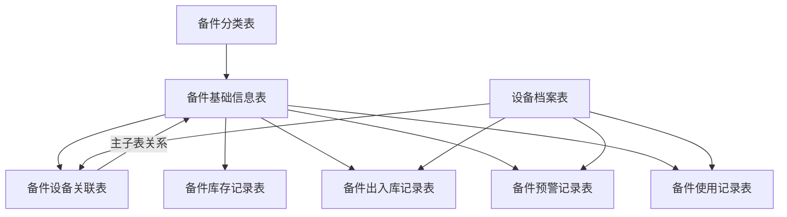
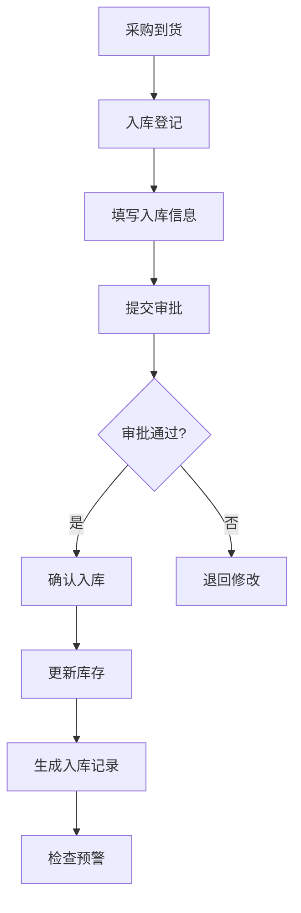
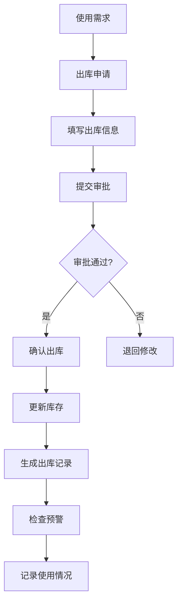
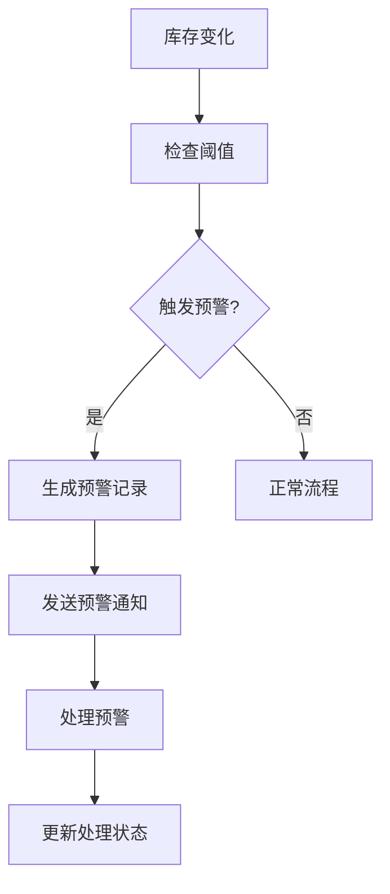

# 备件管理模块完整设计文档

## 📋 目录
1. [模块概述](#模块概述)
2. [数据库设计](#数据库设计)
3. [功能规划](#功能规划)
4. [业务流程](#业务流程)
5. [技术实现](#技术实现)
6. [API设计](#api设计)
7. [前端界面](#前端界面)

## 🎯 模块概述

### 1.1 模块目标
备件管理模块是选煤厂生产管理系统的核心模块之一，旨在实现备件的全生命周期管理，包括：
- 备件基础信息管理
- 库存实时监控
- 出入库流程管理
- 预警机制
- 统计分析

### 1.2 核心功能
- **备件分类管理**: 建立备件分类体系
- **备件基础信息管理**: 备件档案、规格、价格等
- **库存管理**: 实时库存监控、自动更新
- **出入库管理**: 完整的出入库流程
- **预警系统**: 低库存、零库存预警
- **统计分析**: 库存统计、使用分析
- **设备关联**: 备件与设备的关联关系

## 🗄️ 数据库设计

### 2.1 核心表结构

#### 2.1.1 备件分类表 (coal_spare_part_category)
```sql
CREATE TABLE `coal_spare_part_category` (
  `id` bigint NOT NULL AUTO_INCREMENT COMMENT '分类ID',
  `category_name` varchar(100) NOT NULL COMMENT '分类名称',
  `parent_id` bigint DEFAULT '0' COMMENT '父分类ID',
  `category_code` varchar(50) DEFAULT NULL COMMENT '分类编码',
  `description` varchar(500) DEFAULT NULL COMMENT '分类描述',
  `sort_order` int DEFAULT '0' COMMENT '排序',
  `status` tinyint NOT NULL DEFAULT '1' COMMENT '状态',
  `create_time` datetime NOT NULL DEFAULT CURRENT_TIMESTAMP COMMENT '创建时间',
  `update_time` datetime NOT NULL DEFAULT CURRENT_TIMESTAMP ON UPDATE CURRENT_TIMESTAMP COMMENT '更新时间',
  `creator` varchar(64) DEFAULT '' COMMENT '创建者',
  `updater` varchar(64) DEFAULT '' COMMENT '更新者',
  `deleted` bit(1) NOT NULL DEFAULT b'0' COMMENT '是否删除',
  `tenant_id` bigint NOT NULL DEFAULT '0' COMMENT '租户编号',
  PRIMARY KEY (`id`) USING BTREE
) ENGINE=InnoDB DEFAULT CHARSET=utf8mb4 COLLATE=utf8mb4_unicode_ci COMMENT='备件分类表';
```

#### 2.1.2 备件基础信息表 (coal_spare_part_info)
```sql
CREATE TABLE `coal_spare_part_info` (
  `id` bigint NOT NULL AUTO_INCREMENT COMMENT '备件ID',
  `spare_part_code` varchar(100) NOT NULL COMMENT '备件编号',
  `spare_part_name` varchar(200) NOT NULL COMMENT '备件名称',
  `category_id` bigint NOT NULL COMMENT '备件分类ID',
  `specification` varchar(500) NOT NULL COMMENT '规格型号',
  `brand` varchar(100) NOT NULL COMMENT '品牌',
  `unit` varchar(20) NOT NULL COMMENT '计量单位',
  `spare_part_type` int DEFAULT NULL COMMENT '备件类型',
  `material` varchar(100) DEFAULT NULL COMMENT '材质',
  `weight` decimal(10,2) DEFAULT NULL COMMENT '重量(kg)',
  `dimensions` varchar(200) DEFAULT NULL COMMENT '外形尺寸',
  `min_stock` decimal(10,2) DEFAULT NULL COMMENT '最低库存预警数量',
  `max_stock` decimal(10,2) DEFAULT NULL COMMENT '最高库存数量',
  `safety_stock` decimal(10,2) DEFAULT NULL COMMENT '安全库存数量',
  `current_stock` decimal(10,2) DEFAULT '0.00' COMMENT '当前库存数量',
  `unit_price` decimal(10,2) DEFAULT NULL COMMENT '单价',
  `supplier` varchar(200) DEFAULT NULL COMMENT '供应商',
  `supplier_contact` varchar(100) DEFAULT NULL COMMENT '供应商联系方式',
  `purchase_lead_time` int DEFAULT NULL COMMENT '采购周期(天)',
  `is_critical` tinyint(1) NOT NULL DEFAULT '0' COMMENT '是否关键备件',
  `image_url` varchar(500) DEFAULT NULL COMMENT '备件图片URL',
  `manual_url` varchar(500) DEFAULT NULL COMMENT '说明书文件URL',
  `drawing_url` varchar(500) DEFAULT NULL COMMENT '图纸文件URL',
  `remark` text COMMENT '备注',
  `create_time` datetime NOT NULL DEFAULT CURRENT_TIMESTAMP COMMENT '创建时间',
  `update_time` datetime NOT NULL DEFAULT CURRENT_TIMESTAMP ON UPDATE CURRENT_TIMESTAMP COMMENT '更新时间',
  `creator` varchar(64) DEFAULT '' COMMENT '创建者',
  `updater` varchar(64) DEFAULT '' COMMENT '更新者',
  `deleted` bit(1) NOT NULL DEFAULT b'0' COMMENT '是否删除',
  `tenant_id` bigint NOT NULL DEFAULT '0' COMMENT '租户编号',
  PRIMARY KEY (`id`) USING BTREE,
  UNIQUE KEY `uk_spare_part_code` (`spare_part_code`) USING BTREE,
  KEY `idx_category_id` (`category_id`) USING BTREE,
  KEY `idx_spare_part_name` (`spare_part_name`) USING BTREE
) ENGINE=InnoDB DEFAULT CHARSET=utf8mb4 COLLATE=utf8mb4_unicode_ci COMMENT='备件基础信息表';
```

#### 2.1.3 备件库存记录表 (coal_spare_part_stock)
```sql
CREATE TABLE `coal_spare_part_stock` (
  `id` bigint NOT NULL AUTO_INCREMENT COMMENT '库存记录ID',
  `spare_part_id` bigint NOT NULL COMMENT '备件ID',
  `warehouse_location` varchar(100) NOT NULL COMMENT '仓库位置',
  `stock_type` int DEFAULT NULL COMMENT '库存类型',
  `quantity` decimal(10,2) DEFAULT NULL COMMENT '库存数量',
  `unit_cost` decimal(10,2) DEFAULT NULL COMMENT '单位成本',
  `total_cost` decimal(10,2) DEFAULT NULL COMMENT '总成本',
  `batch_no` varchar(100) DEFAULT NULL COMMENT '批次号',
  `production_date` date DEFAULT NULL COMMENT '生产日期',
  `expiry_date` date DEFAULT NULL COMMENT '有效期至',
  `last_in_date` datetime DEFAULT NULL COMMENT '最后入库时间',
  `last_out_date` datetime DEFAULT NULL COMMENT '最后出库时间',
  `remark` varchar(500) DEFAULT NULL COMMENT '备注',
  `create_time` datetime NOT NULL DEFAULT CURRENT_TIMESTAMP COMMENT '创建时间',
  `update_time` datetime NOT NULL DEFAULT CURRENT_TIMESTAMP ON UPDATE CURRENT_TIMESTAMP COMMENT '更新时间',
  `creator` varchar(64) DEFAULT '' COMMENT '创建者',
  `updater` varchar(64) DEFAULT '' COMMENT '更新者',
  `deleted` bit(1) NOT NULL DEFAULT b'0' COMMENT '是否删除',
  `tenant_id` bigint NOT NULL DEFAULT '0' COMMENT '租户编号',
  PRIMARY KEY (`id`) USING BTREE,
  KEY `idx_spare_part` (`spare_part_id`) USING BTREE,
  KEY `idx_warehouse` (`warehouse_location`) USING BTREE,
  KEY `idx_stock_type` (`stock_type`) USING BTREE
) ENGINE=InnoDB DEFAULT CHARSET=utf8mb4 COLLATE=utf8mb4_unicode_ci COMMENT='备件库存记录表';
```

#### 2.1.4 备件出入库记录表 (coal_spare_part_inventory_log)
```sql
CREATE TABLE `coal_spare_part_inventory_log` (
  `id` bigint NOT NULL AUTO_INCREMENT COMMENT '记录ID',
  `spare_part_id` bigint NOT NULL COMMENT '备件ID',
  `operation_type` int NOT NULL COMMENT '操作类型：1-入库，2-出库',
  `operation_date` datetime NOT NULL COMMENT '操作时间',
  `quantity` decimal(10,2) NOT NULL COMMENT '数量',
  `unit_price` decimal(10,2) DEFAULT NULL COMMENT '单价',
  `total_amount` decimal(10,2) DEFAULT NULL COMMENT '总金额',
  `operator_id` bigint NOT NULL COMMENT '操作人员ID',
  `warehouse_location` varchar(100) NOT NULL COMMENT '仓库位置',
  `batch_no` varchar(100) DEFAULT NULL COMMENT '批次号',
  `equipment_id` bigint DEFAULT NULL COMMENT '关联设备ID',
  `work_order_id` bigint DEFAULT NULL COMMENT '工单ID',
  `supplier_id` bigint DEFAULT NULL COMMENT '供应商ID',
  `purchase_order_no` varchar(100) DEFAULT NULL COMMENT '采购单号',
  `approver_id` bigint DEFAULT NULL COMMENT '审批人ID',
  `approve_time` datetime DEFAULT NULL COMMENT '审批时间',
  `approve_status` int DEFAULT '0' COMMENT '审批状态：0-待审批，1-已审批，2-已拒绝',
  `operation_reason` varchar(500) DEFAULT NULL COMMENT '操作原因',
  `remark` varchar(500) DEFAULT NULL COMMENT '备注',
  `create_time` datetime NOT NULL DEFAULT CURRENT_TIMESTAMP COMMENT '创建时间',
  `update_time` datetime NOT NULL DEFAULT CURRENT_TIMESTAMP ON UPDATE CURRENT_TIMESTAMP COMMENT '更新时间',
  `creator` varchar(64) DEFAULT '' COMMENT '创建者',
  `updater` varchar(64) DEFAULT '' COMMENT '更新者',
  `deleted` bit(1) NOT NULL DEFAULT b'0' COMMENT '是否删除',
  `tenant_id` bigint NOT NULL DEFAULT '0' COMMENT '租户编号',
  PRIMARY KEY (`id`) USING BTREE,
  KEY `idx_spare_part` (`spare_part_id`) USING BTREE,
  KEY `idx_operation_type` (`operation_type`) USING BTREE,
  KEY `idx_operation_date` (`operation_date`) USING BTREE,
  KEY `idx_equipment` (`equipment_id`) USING BTREE
) ENGINE=InnoDB DEFAULT CHARSET=utf8mb4 COLLATE=utf8mb4_unicode_ci COMMENT='备件出入库记录表';
```

#### 2.1.5 备件使用记录表 (coal_spare_part_usage_record)
```sql
CREATE TABLE `coal_spare_part_usage_record` (
  `id` bigint NOT NULL AUTO_INCREMENT COMMENT '记录ID',
  `spare_part_id` bigint NOT NULL COMMENT '备件ID',
  `equipment_id` bigint NOT NULL COMMENT '设备ID',
  `usage_date` datetime NOT NULL COMMENT '使用日期',
  `usage_quantity` decimal(10,2) NOT NULL COMMENT '使用数量',
  `usage_reason` varchar(500) DEFAULT NULL COMMENT '使用原因',
  `operator_id` bigint NOT NULL COMMENT '操作人员ID',
  `work_order_id` bigint DEFAULT NULL COMMENT '工单ID',
  `remark` varchar(500) DEFAULT NULL COMMENT '备注',
  `create_time` datetime NOT NULL DEFAULT CURRENT_TIMESTAMP COMMENT '创建时间',
  `update_time` datetime NOT NULL DEFAULT CURRENT_TIMESTAMP ON UPDATE CURRENT_TIMESTAMP COMMENT '更新时间',
  `creator` varchar(64) DEFAULT '' COMMENT '创建者',
  `updater` varchar(64) DEFAULT '' COMMENT '更新者',
  `deleted` bit(1) NOT NULL DEFAULT b'0' COMMENT '是否删除',
  `tenant_id` bigint NOT NULL DEFAULT '0' COMMENT '租户编号',
  PRIMARY KEY (`id`) USING BTREE,
  KEY `idx_spare_part` (`spare_part_id`) USING BTREE,
  KEY `idx_equipment` (`equipment_id`) USING BTREE,
  KEY `idx_usage_date` (`usage_date`) USING BTREE
) ENGINE=InnoDB DEFAULT CHARSET=utf8mb4 COLLATE=utf8mb4_unicode_ci COMMENT='备件使用记录表';
```

#### 2.1.6 备件预警记录表 (coal_spare_part_alert)
```sql
CREATE TABLE `coal_spare_part_alert` (
  `id` bigint NOT NULL AUTO_INCREMENT COMMENT '预警ID',
  `spare_part_id` bigint NOT NULL COMMENT '备件ID',
  `equipment_id` bigint DEFAULT NULL COMMENT '设备ID',
  `alert_type` int NOT NULL COMMENT '预警类型：1-低库存，2-零库存，3-超量库存',
  `alert_level` int NOT NULL COMMENT '预警级别：1-低，2-中，3-高',
  `current_stock` decimal(10,2) NOT NULL COMMENT '当前库存',
  `threshold_value` decimal(10,2) NOT NULL COMMENT '阈值',
  `alert_message` varchar(500) NOT NULL COMMENT '预警信息',
  `alert_time` datetime NOT NULL COMMENT '预警时间',
  `status` int NOT NULL DEFAULT '0' COMMENT '处理状态：0-未处理，1-已处理',
  `handler_id` bigint DEFAULT NULL COMMENT '处理人ID',
  `handle_time` datetime DEFAULT NULL COMMENT '处理时间',
  `handle_result` varchar(500) DEFAULT NULL COMMENT '处理结果',
  `remark` varchar(500) DEFAULT NULL COMMENT '备注',
  `create_time` datetime NOT NULL DEFAULT CURRENT_TIMESTAMP COMMENT '创建时间',
  `update_time` datetime NOT NULL DEFAULT CURRENT_TIMESTAMP ON UPDATE CURRENT_TIMESTAMP COMMENT '更新时间',
  `creator` varchar(64) DEFAULT '' COMMENT '创建者',
  `updater` varchar(64) DEFAULT '' COMMENT '更新者',
  `deleted` bit(1) NOT NULL DEFAULT b'0' COMMENT '是否删除',
  `tenant_id` bigint NOT NULL DEFAULT '0' COMMENT '租户编号',
  PRIMARY KEY (`id`) USING BTREE,
  KEY `idx_spare_part` (`spare_part_id`) USING BTREE,
  KEY `idx_equipment` (`equipment_id`) USING BTREE,
  KEY `idx_alert_type` (`alert_type`) USING BTREE,
  KEY `idx_alert_time` (`alert_time`) USING BTREE
) ENGINE=InnoDB DEFAULT CHARSET=utf8mb4 COLLATE=utf8mb4_unicode_ci COMMENT='备件预警记录表';
```

#### 2.1.7 备件设备关联表 (coal_spare_part_equipment)
```sql
CREATE TABLE `coal_spare_part_equipment` (
  `id` bigint NOT NULL AUTO_INCREMENT COMMENT '关联ID',
  `spare_part_id` bigint NOT NULL COMMENT '备件ID',
  `equipment_id` bigint NOT NULL COMMENT '设备ID',
  `is_required` tinyint(1) NOT NULL DEFAULT '1' COMMENT '是否必需',
  `replacement_difficulty` int DEFAULT '1' COMMENT '更换难度：1-简单，2-中等，3-困难',
  `usage_frequency` int DEFAULT '1' COMMENT '使用频率：1-低，2-中，3-高',
  `last_replacement_date` date DEFAULT NULL COMMENT '最后更换日期',
  `next_maintenance_date` date DEFAULT NULL COMMENT '下次维护日期',
  `remark` varchar(500) DEFAULT NULL COMMENT '备注',
  `create_time` datetime NOT NULL DEFAULT CURRENT_TIMESTAMP COMMENT '创建时间',
  `update_time` datetime NOT NULL DEFAULT CURRENT_TIMESTAMP ON UPDATE CURRENT_TIMESTAMP COMMENT '更新时间',
  `creator` varchar(64) DEFAULT '' COMMENT '创建者',
  `updater` varchar(64) DEFAULT '' COMMENT '更新者',
  `deleted` bit(1) NOT NULL DEFAULT b'0' COMMENT '是否删除',
  `tenant_id` bigint NOT NULL DEFAULT '0' COMMENT '租户编号',
  PRIMARY KEY (`id`) USING BTREE,
  KEY `idx_spare_part` (`spare_part_id`) USING BTREE,
  KEY `idx_equipment` (`equipment_id`) USING BTREE,
  UNIQUE KEY `uk_spare_part_equipment` (`spare_part_id`, `equipment_id`) USING BTREE
) ENGINE=InnoDB DEFAULT CHARSET=utf8mb4 COLLATE=utf8mb4_unicode_ci COMMENT='备件设备关联表';
```

### 2.2 表关系图


## 🎯 功能规划

### 3.1 核心功能模块

#### 3.1.1 备件分类管理
- **功能描述**: 建立备件分类体系，支持多级分类
- **主要操作**: 新增、编辑、删除、查询分类
- **业务规则**: 
  - 支持树形结构分类
  - 分类编码唯一性
  - 删除分类前检查是否有关联备件

#### 3.1.2 备件基础信息管理
- **功能描述**: 管理备件的基本信息、规格参数、价格等
- **主要操作**: 新增、编辑、删除、查询备件信息
- **业务规则**:
  - 备件编号唯一性
  - 支持图片、说明书、图纸文件上传
  - 关键备件标识
  - 库存阈值设置

#### 3.1.3 库存管理
- **功能描述**: 实时监控备件库存状态
- **主要操作**: 库存查询、库存调整、库存预警
- **业务规则**:
  - 实时库存计算
  - 自动库存更新
  - 库存预警机制

#### 3.1.4 出入库管理
- **功能描述**: 管理备件的入库和出库操作
- **主要操作**: 入库登记、出库登记、审批流程
- **业务规则**:
  - 出入库审批流程
  - 自动库存更新
  - 批次管理
  - 关联设备记录

#### 3.1.5 使用记录管理
- **功能描述**: 记录备件的使用情况
- **主要操作**: 使用登记、使用查询、使用分析
- **业务规则**:
  - 使用记录与库存联动
  - 设备关联记录
  - 使用原因记录

#### 3.1.6 预警管理
- **功能描述**: 库存预警和异常提醒
- **主要操作**: 预警查看、预警处理、预警配置
- **业务规则**:
  - 自动预警触发
  - 多级预警机制
  - 预警处理跟踪

#### 3.1.7 设备关联管理
- **功能描述**: 管理备件与设备的关联关系
- **主要操作**: 关联配置、关联查询、维护计划
- **业务规则**:
  - 主子表关系管理
  - 更换难度评估
  - 维护计划制定

#### 3.1.8 统计分析
- **功能描述**: 备件使用和库存统计分析
- **主要操作**: 库存统计、使用分析、趋势分析
- **业务规则**:
  - 多维度统计分析
  - 图表展示
  - 数据导出

## 🔄 业务流程

### 4.1 备件入库流程


### 4.2 备件出库流程


### 4.3 预警处理流程


## 🛠️ 技术实现

### 5.1 后端技术栈
- **框架**: Spring Boot 2.7.x
- **数据库**: MySQL 8.0
- **ORM**: MyBatis-Plus
- **缓存**: Redis
- **消息队列**: RabbitMQ
- **文件存储**: 本地存储/OSS

### 5.2 前端技术栈
- **框架**: Vue 3 + TypeScript
- **UI组件**: Element Plus
- **状态管理**: Pinia
- **路由**: Vue Router
- **图表**: ECharts
- **构建工具**: Vite

### 5.3 核心实现

#### 5.3.1 库存自动更新机制
```java
@Service
public class SparePartInventoryLogServiceImpl implements SparePartInventoryLogService {
    
    @Override
    @Transactional(rollbackFor = Exception.class)
    public Long createSparePartInventoryLog(SparePartInventoryLogSaveReqVO createReqVO) {
        // 创建出入库记录
        SparePartInventoryLogDO inventoryLog = BeanUtils.toBean(createReqVO, SparePartInventoryLogDO.class);
        sparePartInventoryLogMapper.insert(inventoryLog);
        
        // 自动更新库存
        updateStockQuantity(inventoryLog);
        
        // 检查并创建预警
        checkAndCreateAlert(inventoryLog.getSparePartId());
        
        return inventoryLog.getId();
    }
    
    private void updateStockQuantity(SparePartInventoryLogDO log) {
        if (log.getQuantity().compareTo(BigDecimal.ZERO) > 0) {
            // 入库操作
            sparePartStockService.increaseStock(log.getSparePartId(), log.getQuantity());
        } else {
            // 出库操作
            sparePartStockService.decreaseStock(log.getSparePartId(), log.getQuantity().abs());
        }
    }
}
```

#### 5.3.2 预警自动触发机制
```java
@Service
public class SparePartAlertServiceImpl implements SparePartAlertService {
    
    public void checkAndCreateAlert(Long sparePartId) {
        SparePartInfoDO sparePart = sparePartInfoService.getSparePartInfo(sparePartId);
        BigDecimal currentStock = sparePartStockService.getCurrentStock(sparePartId);
        
        if (currentStock.compareTo(BigDecimal.ZERO) == 0) {
            // 零库存预警
            createAlert(sparePartId, 2, 3, currentStock, BigDecimal.ZERO, "零库存预警");
        } else if (sparePart.getMinStock() != null && 
                   currentStock.compareTo(sparePart.getMinStock()) <= 0) {
            // 低库存预警
            createAlert(sparePartId, 1, 2, currentStock, sparePart.getMinStock(), "低库存预警");
        }
    }
}
```

#### 5.3.3 统计数据分析
```java
@Service
public class SparePartInfoServiceImpl implements SparePartInfoService {
    
    @Override
    public SparePartStockStatisticsRespVO getStockStatistics() {
        SparePartStockStatisticsRespVO statistics = new SparePartStockStatisticsRespVO();
        List<SparePartInfoDO> allSpareParts = sparePartInfoMapper.selectList();
        
        statistics.setOverview(calculateStockOverview(allSpareParts));
        statistics.setAlertStatistics(calculateAlertStatistics(allSpareParts));
        statistics.setCategoryStatistics(calculateCategoryStatistics(allSpareParts));
        statistics.setTrendData(calculateTrendData());
        statistics.setAbcStatistics(calculateABCStatistics(allSpareParts));
        
        return statistics;
    }
}
```

## 🔌 API设计

### 6.1 备件基础信息API
```
GET    /admin-api/coal/spare-part-info/page          # 分页查询
GET    /admin-api/coal/spare-part-info/get           # 获取详情
POST   /admin-api/coal/spare-part-info/create        # 新增
PUT    /admin-api/coal/spare-part-info/update        # 修改
DELETE /admin-api/coal/spare-part-info/delete        # 删除
GET    /admin-api/coal/spare-part-info/simple-list   # 简单列表
GET    /admin-api/coal/spare-part-info/stock-statistics # 库存统计
```

### 6.2 库存管理API
```
GET    /admin-api/coal/spare-part-stock/page         # 分页查询
GET    /admin-api/coal/spare-part-stock/get          # 获取详情
POST   /admin-api/coal/spare-part-stock/create       # 新增
PUT    /admin-api/coal/spare-part-stock/update       # 修改
DELETE /admin-api/coal/spare-part-stock/delete       # 删除
```

### 6.3 出入库管理API
```
GET    /admin-api/coal/spare-part-inventory-log/page # 分页查询
GET    /admin-api/coal/spare-part-inventory-log/get  # 获取详情
POST   /admin-api/coal/spare-part-inventory-log/create # 新增
PUT    /admin-api/coal/spare-part-inventory-log/update # 修改
DELETE /admin-api/coal/spare-part-inventory-log/delete # 删除
```

### 6.4 使用记录API
```
GET    /admin-api/coal/spare-part-usage-record/page  # 分页查询
GET    /admin-api/coal/spare-part-usage-record/get   # 获取详情
POST   /admin-api/coal/spare-part-usage-record/create # 新增
PUT    /admin-api/coal/spare-part-usage-record/update # 修改
DELETE /admin-api/coal/spare-part-usage-record/delete # 删除
```

### 6.5 预警管理API
```
GET    /admin-api/coal/spare-part-alert/page         # 分页查询
GET    /admin-api/coal/spare-part-alert/get          # 获取详情
POST   /admin-api/coal/spare-part-alert/create       # 新增
PUT    /admin-api/coal/spare-part-alert/update       # 修改
DELETE /admin-api/coal/spare-part-alert/delete       # 删除
```

### 6.6 设备关联API
```
GET    /admin-api/coal/spare-part-equipment/page     # 分页查询
GET    /admin-api/coal/spare-part-equipment/get      # 获取详情
POST   /admin-api/coal/spare-part-equipment/create   # 新增
PUT    /admin-api/coal/spare-part-equipment/update   # 修改
DELETE /admin-api/coal/spare-part-equipment/delete   # 删除
```

## 🎨 前端界面

### 7.1 页面结构
```
备件管理/
├── 备件分类管理/
│   ├── 分类列表
│   └── 分类表单
├── 备件基础信息/
│   ├── 备件列表
│   ├── 备件表单
│   └── 统计分析
├── 库存管理/
│   ├── 库存列表
│   └── 库存表单
├── 出入库管理/
│   ├── 出入库列表
│   └── 出入库表单
├── 使用记录/
│   ├── 使用记录列表
│   └── 使用记录表单
├── 预警管理/
│   ├── 预警列表
│   └── 预警处理
└── 设备关联/
    ├── 关联列表
    └── 关联表单
```

### 7.2 首页统计卡片
- **备件种类**: 显示总备件类型数量
- **总库存**: 显示总库存数量
- **零库存**: 显示零库存备件数量
- **低库存**: 显示低库存备件数量
- **库存健康度**: 显示库存健康评分

### 7.3 统计分析页面
- **库存概览**: 总体库存情况
- **分类统计**: 按分类统计库存
- **趋势分析**: 库存变化趋势
- **ABC分析**: 备件重要性分析
- **预警统计**: 预警情况统计

## 📊 数据字典

### 8.1 备件类型 (spare_part_type)
- 1: 机械备件
- 2: 电气备件
- 3: 液压备件
- 4: 气动备件
- 5: 其他

### 8.2 操作类型 (operation_type)
- 1: 入库
- 2: 出库

### 8.3 预警类型 (alert_type)
- 1: 低库存
- 2: 零库存
- 3: 超量库存

### 8.4 预警级别 (alert_level)
- 1: 低
- 2: 中
- 3: 高

### 8.5 审批状态 (approve_status)
- 0: 待审批
- 1: 已审批
- 2: 已拒绝

### 8.6 是否关键备件 (is_critical_spare_part)
- 0: 否
- 1: 是

### 8.7 更换难度 (replacement_difficulty)
- 1: 简单
- 2: 中等
- 3: 困难

### 8.8 使用频率 (usage_frequency)
- 1: 低
- 2: 中
- 3: 高

## 🔧 配置说明

### 9.1 文件上传配置
```yaml
# 文件上传配置
yudao:
  file:
    base-path: /Users/yunai/file_test
    public-path: /admin-api/infra/file
```

### 9.2 数据库配置
```yaml
# 数据库配置
spring:
  datasource:
    url: jdbc:mysql://127.0.0.1:3306/ruoyi-vue-pro?useUnicode=true&characterEncoding=UTF-8&autoReconnect=true&serverTimezone=Asia/Shanghai&allowPublicKeyRetrieval=true&nullCatalogMeansCurrent=true
    username: root
    password: lijing134
```

### 9.3 缓存配置
```yaml
# Redis配置
spring:
  redis:
    host: 127.0.0.1
    port: 6379
    password: 
    database: 1
```

## 📝 开发规范

### 10.1 代码规范
- 遵循阿里巴巴Java开发手册
- 使用统一的代码格式化配置
- 添加必要的注释和文档

### 10.2 数据库规范
- 表名使用下划线命名法
- 字段名使用下划线命名法
- 必须包含创建时间、更新时间、创建者、更新者、删除标记、租户ID

### 10.3 API规范
- 使用RESTful API设计
- 统一的响应格式
- 完善的错误处理

### 10.4 前端规范
- 使用TypeScript
- 组件化开发
- 统一的UI风格

---

**文档版本**: v1.0  
**创建时间**: 2025-01-09  
**更新时间**: 2025-01-09  
**维护人员**: 开发团队
