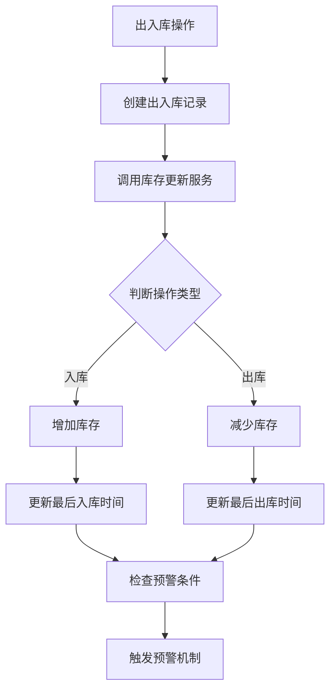

# 备件管理模块技术实现文档

## 📋 目录
1. [库存自动更新机制](#库存自动更新机制)
2. [预警自动触发机制](#预警自动触发机制)
3. [库存统计分析功能](#库存统计分析功能)
4. [首页统计卡片实现](#首页统计卡片实现)
5. [文件上传功能实现](#文件上传功能实现)
6. [数据关联处理](#数据关联处理)

## 🔄 库存自动更新机制

### 1.1 机制概述
库存自动更新机制是备件管理模块的核心功能，确保出入库操作后库存数据实时准确。

### 1.2 实现原理


### 1.3 核心代码实现

#### 1.3.1 出入库记录服务
```java
@Service
@Validated
public class SparePartInventoryLogServiceImpl implements SparePartInventoryLogService {

    @Resource
    private SparePartStockService sparePartStockService;
    
    @Resource
    private SparePartAlertService sparePartAlertService;

    @Override
    @Transactional(rollbackFor = Exception.class)
    public Long createSparePartInventoryLog(SparePartInventoryLogSaveReqVO createReqVO) {
        // 1. 创建出入库记录
        SparePartInventoryLogDO inventoryLog = BeanUtils.toBean(createReqVO, SparePartInventoryLogDO.class);
        sparePartInventoryLogMapper.insert(inventoryLog);
        
        // 2. 自动更新库存
        updateStockQuantity(inventoryLog);
        
        // 3. 检查并创建预警
        checkAndCreateAlert(inventoryLog.getSparePartId());
        
        return inventoryLog.getId();
    }

    /**
     * 更新库存数量
     */
    private void updateStockQuantity(SparePartInventoryLogDO log) {
        if (log.getQuantity().compareTo(BigDecimal.ZERO) > 0) {
            // 入库操作 - 增加库存
            sparePartStockService.increaseStock(log.getSparePartId(), log.getQuantity());
        } else {
            // 出库操作 - 减少库存
            sparePartStockService.decreaseStock(log.getSparePartId(), log.getQuantity().abs());
        }
    }

    /**
     * 检查并创建预警
     */
    private void checkAndCreateAlert(Long sparePartId) {
        try {
            sparePartAlertService.checkAndCreateAlert(sparePartId);
        } catch (Exception e) {
            // 预警创建失败不影响主流程
            log.error("创建预警失败，备件ID: {}", sparePartId, e);
        }
    }
}
```

#### 1.3.2 库存服务实现
```java
@Service
@Validated
public class SparePartStockServiceImpl implements SparePartStockService {

    @Override
    @Transactional(rollbackFor = Exception.class)
    public void increaseStock(Long sparePartId, BigDecimal quantity) {
        // 查找或创建库存记录
        SparePartStockDO stock = getOrCreateStock(sparePartId);
        
        // 增加库存数量
        stock.setQuantity(stock.getQuantity().add(quantity));
        
        // 更新最后入库时间
        stock.setLastInDate(LocalDateTime.now());
        
        // 更新库存记录
        sparePartStockMapper.updateById(stock);
    }

    @Override
    @Transactional(rollbackFor = Exception.class)
    public void decreaseStock(Long sparePartId, BigDecimal quantity) {
        // 查找库存记录
        SparePartStockDO stock = getOrCreateStock(sparePartId);
        
        // 检查库存是否充足
        if (stock.getQuantity().compareTo(quantity) < 0) {
            throw exception(SPARE_PART_STOCK_NOT_EXISTS, "库存不足，当前库存：" + stock.getQuantity() + "，需要数量：" + quantity);
        }
        
        // 减少库存数量
        stock.setQuantity(stock.getQuantity().subtract(quantity));
        
        // 更新最后出库时间
        stock.setLastOutDate(LocalDateTime.now());
        
        // 更新库存记录
        sparePartStockMapper.updateById(stock);
    }

    /**
     * 获取或创建库存记录
     */
    private SparePartStockDO getOrCreateStock(Long sparePartId) {
        // 查找现有库存记录
        SparePartStockDO stock = sparePartStockMapper.selectBySparePartId(sparePartId);
        
        if (stock == null) {
            // 创建新的库存记录
            stock = new SparePartStockDO();
            stock.setSparePartId(sparePartId);
            stock.setQuantity(BigDecimal.ZERO);
            stock.setStockType(1); // 默认库存类型
            stock.setWarehouseLocation("默认仓库"); // 设置默认仓库位置
            stock.setUnitCost(BigDecimal.ZERO); // 设置默认单位成本
            stock.setTotalCost(BigDecimal.ZERO); // 设置默认总成本
            sparePartStockMapper.insert(stock);
        }
        
        return stock;
    }
}
```

### 1.4 关键特性
- **事务保证**: 使用 `@Transactional` 确保数据一致性
- **自动创建**: 库存记录不存在时自动创建
- **时间记录**: 自动更新最后出入库时间
- **异常处理**: 完善的异常处理机制

## ⚠️ 预警自动触发机制

### 2.1 机制概述
预警自动触发机制在库存变化时自动检查预警条件，确保及时发现问题。

### 2.2 预警类型
- **零库存预警**: 库存为0时触发
- **低库存预警**: 库存低于最小库存时触发
- **超量库存预警**: 库存超过最大库存时触发

### 2.3 实现代码
```java
@Service
@Validated
public class SparePartAlertServiceImpl implements SparePartAlertService {

    @Resource
    private SparePartInfoService sparePartInfoService;
    
    @Resource
    private SparePartStockService sparePartStockService;

    @Override
    public void checkAndCreateAlert(Long sparePartId) {
        try {
            // 获取备件信息
            SparePartInfoDO sparePart = sparePartInfoService.getSparePartInfo(sparePartId);
            if (sparePart == null) {
                return;
            }
            
            // 获取当前库存
            BigDecimal currentStock = sparePartStockService.getCurrentStock(sparePartId);
            if (currentStock == null) {
                currentStock = BigDecimal.ZERO;
            }
            
            // 检查零库存预警
            if (currentStock.compareTo(BigDecimal.ZERO) == 0) {
                createAlert(sparePartId, 2, 3, currentStock, BigDecimal.ZERO, "零库存预警");
            }
            // 检查低库存预警
            else if (sparePart.getMinStock() != null && 
                     currentStock.compareTo(sparePart.getMinStock()) <= 0) {
                createAlert(sparePartId, 1, 2, currentStock, sparePart.getMinStock(), "低库存预警");
            }
            // 检查超量库存预警
            else if (sparePart.getMaxStock() != null && 
                     currentStock.compareTo(sparePart.getMaxStock()) > 0) {
                createAlert(sparePartId, 3, 1, currentStock, sparePart.getMaxStock(), "超量库存预警");
            }
            
        } catch (Exception e) {
            log.error("检查预警条件失败，备件ID: {}", sparePartId, e);
        }
    }

    /**
     * 创建预警记录
     */
    private void createAlert(Long sparePartId, Integer alertType, Integer alertLevel, 
                           BigDecimal currentStock, BigDecimal thresholdValue, String alertMessage) {
        // 检查是否已存在相同类型的未处理预警
        SparePartAlertDO existingAlert = sparePartAlertMapper.selectBySparePartIdAndType(sparePartId, alertType);
        if (existingAlert != null && existingAlert.getStatus() == 0) {
            return; // 已存在未处理预警，不重复创建
        }
        
        // 创建新预警记录
        SparePartAlertDO alert = new SparePartAlertDO();
        alert.setSparePartId(sparePartId);
        alert.setAlertType(alertType);
        alert.setAlertLevel(alertLevel);
        alert.setCurrentStock(currentStock);
        alert.setThresholdValue(thresholdValue);
        alert.setAlertMessage(alertMessage);
        alert.setAlertTime(LocalDateTime.now());
        alert.setStatus(0); // 未处理
        
        sparePartAlertMapper.insert(alert);
        
        // 发送预警通知（可扩展）
        sendAlertNotification(alert);
    }

    /**
     * 发送预警通知
     */
    private void sendAlertNotification(SparePartAlertDO alert) {
        // TODO: 实现预警通知逻辑
        // 可以发送邮件、短信、系统消息等
        log.info("发送预警通知: {}", alert.getAlertMessage());
    }
}
```

### 2.4 预警配置
- **预警级别**: 1-低，2-中，3-高
- **处理状态**: 0-未处理，1-已处理
- **通知机制**: 支持多种通知方式

## 📊 库存统计分析功能

### 3.1 功能概述
库存统计分析功能提供多维度、可视化的库存数据分析。

### 3.2 统计维度
- **库存概览**: 总体库存情况
- **预警统计**: 各类预警数量统计
- **分类统计**: 按分类统计库存
- **趋势分析**: 库存变化趋势
- **ABC分析**: 备件重要性分析

### 3.3 实现代码
```java
@Service
@Validated
public class SparePartInfoServiceImpl implements SparePartInfoService {

    @Resource
    private SparePartStockService sparePartStockService;
    
    @Resource
    private SparePartCategoryService sparePartCategoryService;

    @Override
    public SparePartStockStatisticsRespVO getStockStatistics() {
        SparePartStockStatisticsRespVO statistics = new SparePartStockStatisticsRespVO();
        List<SparePartInfoDO> allSpareParts = sparePartInfoMapper.selectList();
        
        // 计算各项统计
        statistics.setOverview(calculateStockOverview(allSpareParts));
        statistics.setAlertStatistics(calculateAlertStatistics(allSpareParts));
        statistics.setCategoryStatistics(calculateCategoryStatistics(allSpareParts));
        statistics.setTrendData(calculateTrendData());
        statistics.setAbcStatistics(calculateABCStatistics(allSpareParts));
        
        return statistics;
    }

    /**
     * 计算库存概览
     */
    private SparePartStockStatisticsRespVO.StockOverview calculateStockOverview(List<SparePartInfoDO> spareParts) {
        SparePartStockStatisticsRespVO.StockOverview overview = new SparePartStockStatisticsRespVO.StockOverview();
        
        overview.setTotalSparePartTypes(spareParts.size());
        
        BigDecimal totalQuantity = BigDecimal.ZERO;
        BigDecimal totalValue = BigDecimal.ZERO;
        int healthyCount = 0;
        
        for (SparePartInfoDO sparePart : spareParts) {
            try {
                BigDecimal currentStock = sparePartStockService.getCurrentStock(sparePart.getId());
                if (currentStock != null) {
                    totalQuantity = totalQuantity.add(currentStock);
                }
                
                if (sparePart.getUnitPrice() != null && currentStock != null) {
                    BigDecimal stockValue = currentStock.multiply(sparePart.getUnitPrice());
                    totalValue = totalValue.add(stockValue);
                }
                
                // 判断库存健康度
                if (currentStock != null && sparePart.getMinStock() != null && sparePart.getMaxStock() != null) {
                    if (currentStock.compareTo(sparePart.getMinStock()) > 0 && 
                        currentStock.compareTo(sparePart.getMaxStock()) <= 0) {
                        healthyCount++;
                    }
                }
            } catch (Exception e) {
                log.error("处理备件 {} 时发生异常: {}", sparePart.getId(), e.getMessage());
            }
        }
        
        overview.setTotalStockQuantity(totalQuantity);
        overview.setTotalStockValue(totalValue);
        overview.setAverageTurnoverRate(BigDecimal.ZERO); // TODO: 计算周转率
        overview.setHealthScore(healthyCount * 100 / spareParts.size());
        
        return overview;
    }

    /**
     * 计算预警统计
     */
    private SparePartStockStatisticsRespVO.AlertStatistics calculateAlertStatistics(List<SparePartInfoDO> spareParts) {
        SparePartStockStatisticsRespVO.AlertStatistics alertStats = new SparePartStockStatisticsRespVO.AlertStatistics();
        
        int lowStockCount = 0;
        int zeroStockCount = 0;
        int overStockCount = 0;
        int stagnantStockCount = 0;
        
        for (SparePartInfoDO sparePart : spareParts) {
            try {
                BigDecimal currentStock = sparePartStockService.getCurrentStock(sparePart.getId());
                if (currentStock == null) {
                    currentStock = BigDecimal.ZERO;
                }
                
                if (currentStock.compareTo(BigDecimal.ZERO) == 0) {
                    zeroStockCount++;
                } else if (sparePart.getMinStock() != null && 
                          currentStock.compareTo(sparePart.getMinStock()) <= 0) {
                    lowStockCount++;
                } else if (sparePart.getMaxStock() != null && 
                          currentStock.compareTo(sparePart.getMaxStock()) > 0) {
                    overStockCount++;
                }
                
                // TODO: 计算呆滞库存
            } catch (Exception e) {
                log.error("处理备件 {} 预警统计时发生异常: {}", sparePart.getId(), e.getMessage());
            }
        }
        
        alertStats.setLowStockCount(lowStockCount);
        alertStats.setZeroStockCount(zeroStockCount);
        alertStats.setOverStockCount(overStockCount);
        alertStats.setStagnantStockCount(stagnantStockCount);
        
        return alertStats;
    }
}
```

### 3.4 前端展示
```vue
<template>
  <div class="statistics-container">
    <!-- 库存概览 -->
    <el-row :gutter="20">
      <el-col :span="6">
        <el-card>
          <div class="stat-item">
            <div class="stat-value">{{ statistics.overview.totalSparePartTypes }}</div>
            <div class="stat-label">备件种类</div>
          </div>
        </el-card>
      </el-col>
      <el-col :span="6">
        <el-card>
          <div class="stat-item">
            <div class="stat-value">{{ formatNumber(statistics.overview.totalStockQuantity) }}</div>
            <div class="stat-label">总库存</div>
          </div>
        </el-card>
      </el-col>
      <el-col :span="6">
        <el-card>
          <div class="stat-item">
            <div class="stat-value">{{ statistics.alertStatistics.zeroStockCount }}</div>
            <div class="stat-label">零库存</div>
          </div>
        </el-card>
      </el-col>
      <el-col :span="6">
        <el-card>
          <div class="stat-item">
            <div class="stat-value">{{ statistics.alertStatistics.lowStockCount }}</div>
            <div class="stat-label">低库存</div>
          </div>
        </el-card>
      </el-col>
    </el-row>

    <!-- 图表展示 -->
    <el-row :gutter="20" class="mt-4">
      <el-col :span="12">
        <el-card title="分类统计">
          <div ref="categoryChart" style="height: 300px;"></div>
        </el-card>
      </el-col>
      <el-col :span="12">
        <el-card title="趋势分析">
          <div ref="trendChart" style="height: 300px;"></div>
        </el-card>
      </el-col>
    </el-row>
  </div>
</template>
```

## 🏠 首页统计卡片实现

### 4.1 功能概述
首页统计卡片提供备件库存的快速概览，帮助用户快速了解库存状况。

### 4.2 实现代码
```vue
<template>
  <!-- 备件库存统计卡片 -->
  <el-card shadow="never" class="mt-8px">
    <template #header>
      <div class="h-3 flex justify-between">
        <span>备件库存统计</span>
        <el-button type="text" size="small" @click="getSparePartStatistics" :loading="sparePartLoading">
          刷新
        </el-button>
      </div>
    </template>
    <el-skeleton :loading="sparePartLoading" animated>
      <div v-if="sparePartStats">
        <el-row :gutter="12">
          <el-col :span="12">
            <div class="text-center p-3 bg-blue-50 rounded-lg">
              <div class="text-20px font-bold text-blue-600">{{ sparePartStats.overview?.totalSparePartTypes || 0 }}</div>
              <div class="text-12px text-gray-500 mt-1">备件种类</div>
            </div>
          </el-col>
          <el-col :span="12">
            <div class="text-center p-3 bg-green-50 rounded-lg">
              <div class="text-20px font-bold text-green-600">{{ formatNumber(sparePartStats.overview?.totalStockQuantity) }}</div>
              <div class="text-12px text-gray-500 mt-1">总库存</div>
            </div>
          </el-col>
        </el-row>
        <el-row :gutter="12" class="mt-3">
          <el-col :span="12">
            <div class="text-center p-3 bg-orange-50 rounded-lg">
              <div class="text-20px font-bold text-orange-600">{{ sparePartStats.alertStatistics?.zeroStockCount || 0 }}</div>
              <div class="text-12px text-gray-500 mt-1">零库存</div>
            </div>
          </el-col>
          <el-col :span="12">
            <div class="text-center p-3 bg-red-50 rounded-lg">
              <div class="text-20px font-bold text-red-600">{{ sparePartStats.alertStatistics?.lowStockCount || 0 }}</div>
              <div class="text-12px text-gray-500 mt-1">低库存</div>
            </div>
          </el-col>
        </el-row>
        <div class="mt-3 text-center">
          <div class="text-14px text-gray-600">库存健康度</div>
          <div class="text-24px font-bold" :class="getHealthScoreColor(sparePartStats.overview?.healthScore)">
            {{ sparePartStats.overview?.healthScore || 0 }}%
          </div>
        </div>
      </div>
      <div v-else class="text-center text-gray-400 py-8">
        暂无统计数据
      </div>
    </el-skeleton>
  </el-card>
</template>

<script setup lang="ts">
import { SparePartInfoApi } from '@/api/coal/sparepartinfo'

const sparePartLoading = ref(false)
const sparePartStats = ref<any>(null)

// 获取备件统计数据
const getSparePartStatistics = async () => {
  try {
    sparePartLoading.value = true
    console.log('开始获取备件统计数据...')
    const response = await SparePartInfoApi.getStockStatistics()
    console.log('备件统计数据完整响应:', response)
    console.log('响应类型:', typeof response)
    console.log('响应结构:', Object.keys(response))
    
    // 检查响应结构
    if (response && response.data) {
      console.log('response.data 存在:', response.data)
      sparePartStats.value = response.data
    } else if (response && response.overview) {
      console.log('response 直接包含数据:', response)
      sparePartStats.value = response
    } else {
      console.log('响应结构异常，使用默认数据')
      sparePartStats.value = {
        overview: {
          totalSparePartTypes: 0,
          totalStockQuantity: 0,
          totalStockValue: 0,
          averageTurnoverRate: 0,
          healthScore: 0
        },
        alertStatistics: {
          lowStockCount: 0,
          zeroStockCount: 0,
          overStockCount: 0,
          stagnantStockCount: 0
        }
      }
    }
    
    console.log('备件统计数据设置成功:', sparePartStats.value)
  } catch (error) {
    console.error('获取备件统计数据失败:', error)
    // 设置默认数据，避免显示"暂无统计数据"
    sparePartStats.value = {
      overview: {
        totalSparePartTypes: 0,
        totalStockQuantity: 0,
        totalStockValue: 0,
        averageTurnoverRate: 0,
        healthScore: 0
      },
      alertStatistics: {
        lowStockCount: 0,
        zeroStockCount: 0,
        overStockCount: 0,
        stagnantStockCount: 0
      }
    }
  } finally {
    sparePartLoading.value = false
  }
}

// 格式化数字
const formatNumber = (value: any) => {
  if (!value) return '0'
  return Number(value).toLocaleString()
}

// 获取健康度颜色
const getHealthScoreColor = (score: number) => {
  if (score >= 80) return 'text-green-600'
  if (score >= 60) return 'text-yellow-600'
  return 'text-red-600'
}

// 初始化数据
onMounted(() => {
  getSparePartStatistics()
})
</script>
```

### 4.3 关键特性
- **实时数据**: 支持手动刷新获取最新数据
- **加载状态**: 显示加载动画提升用户体验
- **错误处理**: 完善的错误处理和默认数据显示
- **响应式设计**: 适配不同屏幕尺寸

## 📁 文件上传功能实现

### 5.1 功能概述
文件上传功能支持备件图片、说明书、图纸等文件的上传和管理。

### 5.2 实现代码
```vue
<template>
  <el-form-item label="备件图片" prop="imageUrl">
    <UploadImg v-model="formData.imageUrl" :limit="1" />
  </el-form-item>
  
  <el-form-item label="说明书文件" prop="manualUrl">
    <UploadFile v-model="formData.manualUrl" :limit="1" :fileType="['pdf', 'doc', 'docx']" />
  </el-form-item>
  
  <el-form-item label="图纸文件" prop="drawingUrl">
    <UploadFile v-model="formData.drawingUrl" :limit="1" :fileType="['pdf', 'dwg', 'dxf', 'jpg', 'png']" />
  </el-form-item>
</template>

<script setup lang="ts">
// 表单数据初始化
const formData = ref({
  imageUrl: '',
  manualUrl: '',
  drawingUrl: ''
})

// 重置表单
const resetForm = () => {
  formData.value = {
    imageUrl: '',
    manualUrl: '',
    drawingUrl: ''
  }
}
</script>
```

### 5.3 文件类型限制
- **图片文件**: jpg, jpeg, png, gif
- **文档文件**: pdf, doc, docx
- **图纸文件**: pdf, dwg, dxf, jpg, png

## 🔗 数据关联处理

### 6.1 备件名称显示
```vue
<template>
  <!-- 列表显示备件名称 -->
  <el-table-column label="备件名称" prop="sparePartName" width="200px" />
  
  <!-- 表单下拉选择 -->
  <el-form-item label="备件名称" prop="sparePartId">
    <el-select v-model="formData.sparePartId" placeholder="请选择备件">
      <el-option
        v-for="item in sparePartList"
        :key="item.id"
        :label="item.sparePartName"
        :value="item.id"
      />
    </el-select>
  </el-form-item>
</template>

<script setup lang="ts">
import { SparePartInfoApi } from '@/api/coal/sparepartinfo'

const sparePartList = ref<any[]>([])

// 获取备件列表
const getSparePartList = async () => {
  try {
    const response = await SparePartInfoApi.getSimpleSparePartList()
    sparePartList.value = response.data
  } catch (error) {
    console.error('获取备件列表失败:', error)
  }
}

// 获取备件名称
const getSparePartName = (sparePartId: number) => {
  const sparePart = sparePartList.value.find(item => item.id === sparePartId)
  return sparePart ? sparePart.sparePartName : sparePartId
}

onMounted(() => {
  getSparePartList()
})
</script>
```

### 6.2 设备名称显示
```vue
<template>
  <!-- 列表显示设备名称 -->
  <el-table-column label="设备名称" prop="equipmentName" width="200px" />
  
  <!-- 表单下拉选择 -->
  <el-form-item label="设备名称" prop="equipmentId">
    <el-select v-model="formData.equipmentId" placeholder="请选择设备">
      <el-option
        v-for="item in equipmentList"
        :key="item.id"
        :label="item.equipmentName"
        :value="item.id"
      />
    </el-select>
  </el-form-item>
</template>

<script setup lang="ts">
import { EquipmentInfoApi } from '@/api/coal/equipmentinfo'

const equipmentList = ref<any[]>([])

// 获取设备列表
const getEquipmentList = async () => {
  try {
    const response = await EquipmentInfoApi.getSimpleEquipmentList()
    equipmentList.value = response.data
  } catch (error) {
    console.error('获取设备列表失败:', error)
  }
}

onMounted(() => {
  getEquipmentList()
})
</script>
```

## 🔧 技术要点总结

### 7.1 事务管理
- 使用 `@Transactional` 确保数据一致性
- 关键操作使用事务回滚机制

### 7.2 异常处理
- 完善的 try-catch 异常处理
- 详细的错误日志记录
- 优雅的降级处理

### 7.3 性能优化
- 批量数据处理
- 缓存机制应用
- 数据库查询优化

### 7.4 用户体验
- 加载状态显示
- 错误提示友好
- 操作反馈及时

---

**文档版本**: v1.0  
**创建时间**: 2025-01-09  
**更新时间**: 2025-01-09  
**维护人员**: 开发团队
