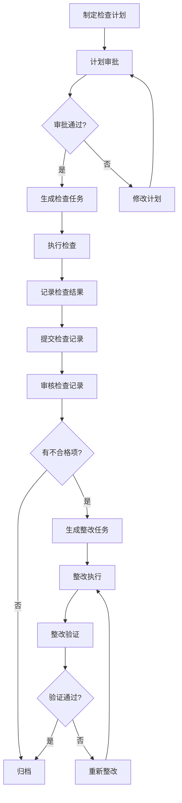
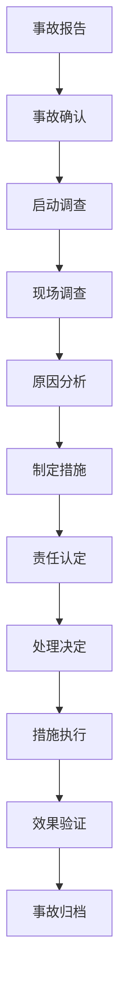

# 安全管理模块设计文档

## 🎯 模块概述

安全管理模块是选煤厂生产管理系统中的重要组成部分，包含安全检查和事故处理两部分。按照PDCA执行原理，从发现、执行、检查，通过系统每个步骤进行追踪、提醒督办。通过移动终端可使用"图片、语音、视频"多种手段记录安全检查事项，清晰准确。

### 📋 功能特点

- **安全检查管理**：支持检查计划制定、执行、记录、整改全流程管理
- **事故管理**：安全事故记录、调查、处理、归档全流程管理
- **移动端支持**：支持图片、语音、视频等多种记录方式
- **流程管控**：按照PDCA原理，实现闭环管理
- **智能提醒**：自动推送检查任务，超期提醒整改
- **统计分析**：安全检查统计、事故统计分析

---

## 🗄️ 数据库表设计

### 1. 安全检查分类表 (coal_safety_check_category) - 树表

**用途**：管理安全检查的分类，支持树形结构，包含安全检查、隐患排查、事故分类等。

```sql
-- 安全检查分类表
CREATE TABLE `coal_safety_check_category` (
  `id` bigint NOT NULL AUTO_INCREMENT COMMENT '分类ID',
  `parent_id` bigint NOT NULL DEFAULT '0' COMMENT '父分类ID',
  `category_name` varchar(100) NOT NULL COMMENT '分类名称',
  `category_code` varchar(50) NOT NULL COMMENT '分类编码',
  `category_type` tinyint NOT NULL DEFAULT '1' COMMENT '分类类型：1-安全检查 2-隐患排查 3-事故分类',
  `sort` int NOT NULL DEFAULT '0' COMMENT '显示顺序',
  `status` tinyint NOT NULL DEFAULT '1' COMMENT '状态：0-禁用 1-启用',
  `remark` varchar(500) DEFAULT NULL COMMENT '备注',
  `creator` varchar(64) DEFAULT '' COMMENT '创建者',
  `create_time` datetime NOT NULL DEFAULT CURRENT_TIMESTAMP COMMENT '创建时间',
  `updater` varchar(64) DEFAULT '' COMMENT '更新者',
  `update_time` datetime NOT NULL DEFAULT CURRENT_TIMESTAMP ON UPDATE CURRENT_TIMESTAMP COMMENT '更新时间',
  `deleted` bit(1) NOT NULL DEFAULT b'0' COMMENT '是否删除',
  `tenant_id` bigint NOT NULL DEFAULT '0' COMMENT '租户编号',
  PRIMARY KEY (`id`),
  UNIQUE KEY `uk_category_code` (`category_code`, `tenant_id`, `deleted`),
  KEY `idx_parent_id` (`parent_id`),
  KEY `idx_category_type` (`category_type`)
) ENGINE=InnoDB DEFAULT CHARSET=utf8mb4 COLLATE=utf8mb4_unicode_ci COMMENT='安全检查分类表';
```

**字段说明**：
- `category_type`：区分不同类型的分类（安全检查、隐患排查、事故分类）
- `parent_id`：支持树形结构，0表示根节点
- `category_code`：分类编码，用于系统识别

### 2. 安全检查计划表 (coal_safety_check_plan) - 单表

**用途**：制定安全检查计划，支持不同周期和类型的检查计划。

```sql
-- 安全检查计划表
CREATE TABLE `coal_safety_check_plan` (
  `id` bigint NOT NULL AUTO_INCREMENT COMMENT '计划ID',
  `plan_code` varchar(50) NOT NULL COMMENT '计划编号',
  `plan_name` varchar(200) NOT NULL COMMENT '计划名称',
  `plan_type` tinyint NOT NULL DEFAULT '1' COMMENT '计划类型：1-日常检查 2-专项检查 3-定期检查 4-突击检查',
  `check_category_id` bigint NOT NULL COMMENT '检查分类ID',
  `check_cycle` tinyint NOT NULL DEFAULT '1' COMMENT '检查周期：1-每日 2-每周 3-每月 4-每季度 5-每年',
  `check_frequency` int NOT NULL DEFAULT '1' COMMENT '检查频次',
  `responsible_person_id` bigint NOT NULL COMMENT '负责人ID',
  `responsible_person_name` varchar(50) NOT NULL COMMENT '负责人姓名',
  `check_area` varchar(200) DEFAULT NULL COMMENT '检查区域',
  `check_content` text COMMENT '检查内容',
  `check_standard` text COMMENT '检查标准',
  `start_date` date NOT NULL COMMENT '开始日期',
  `end_date` date NOT NULL COMMENT '结束日期',
  `plan_status` tinyint NOT NULL DEFAULT '1' COMMENT '计划状态：1-待执行 2-执行中 3-已完成 4-已取消',
  `approval_status` tinyint NOT NULL DEFAULT '1' COMMENT '审批状态：1-待审批 2-已审批 3-已拒绝',
  `approver_id` bigint DEFAULT NULL COMMENT '审批人ID',
  `approver_name` varchar(50) DEFAULT NULL COMMENT '审批人姓名',
  `approval_time` datetime DEFAULT NULL COMMENT '审批时间',
  `approval_remark` varchar(500) DEFAULT NULL COMMENT '审批备注',
  `remark` varchar(500) DEFAULT NULL COMMENT '备注',
  `creator` varchar(64) DEFAULT '' COMMENT '创建者',
  `create_time` datetime NOT NULL DEFAULT CURRENT_TIMESTAMP COMMENT '创建时间',
  `updater` varchar(64) DEFAULT '' COMMENT '更新者',
  `update_time` datetime NOT NULL DEFAULT CURRENT_TIMESTAMP ON UPDATE CURRENT_TIMESTAMP COMMENT '更新时间',
  `deleted` bit(1) NOT NULL DEFAULT b'0' COMMENT '是否删除',
  `tenant_id` bigint NOT NULL DEFAULT '0' COMMENT '租户编号',
  PRIMARY KEY (`id`),
  UNIQUE KEY `uk_plan_code` (`plan_code`, `tenant_id`, `deleted`),
  KEY `idx_check_category_id` (`check_category_id`),
  KEY `idx_responsible_person_id` (`responsible_person_id`),
  KEY `idx_plan_status` (`plan_status`),
  KEY `idx_start_date` (`start_date`)
) ENGINE=InnoDB DEFAULT CHARSET=utf8mb4 COLLATE=utf8mb4_unicode_ci COMMENT='安全检查计划表';
```

**字段说明**：
- `plan_type`：区分不同类型的检查计划
- `check_cycle`：检查周期，支持日、周、月、季度、年
- `check_frequency`：检查频次，配合周期使用
- `plan_status`：计划执行状态跟踪

### 3. 安全检查记录表 (coal_safety_check_record) - 主子表

**用途**：记录安全检查的执行情况，包含主表和子表，主表记录整体检查情况，子表记录具体检查项目。

#### 主表：安全检查记录表
```sql
-- 安全检查记录表（主表）
CREATE TABLE `coal_safety_check_record` (
  `id` bigint NOT NULL AUTO_INCREMENT COMMENT '记录ID',
  `record_code` varchar(50) NOT NULL COMMENT '记录编号',
  `plan_id` bigint DEFAULT NULL COMMENT '计划ID',
  `check_type` tinyint NOT NULL DEFAULT '1' COMMENT '检查类型：1-计划检查 2-临时检查 3-专项检查',
  `check_category_id` bigint NOT NULL COMMENT '检查分类ID',
  `check_date` date NOT NULL COMMENT '检查日期',
  `check_time` datetime NOT NULL COMMENT '检查时间',
  `checker_id` bigint NOT NULL COMMENT '检查人ID',
  `checker_name` varchar(50) NOT NULL COMMENT '检查人姓名',
  `check_area` varchar(200) NOT NULL COMMENT '检查区域',
  `weather_condition` varchar(50) DEFAULT NULL COMMENT '天气情况',
  `temperature` decimal(5,2) DEFAULT NULL COMMENT '温度(℃)',
  `humidity` decimal(5,2) DEFAULT NULL COMMENT '湿度(%)',
  `check_summary` text COMMENT '检查总结',
  `total_items` int NOT NULL DEFAULT '0' COMMENT '检查项目总数',
  `qualified_items` int NOT NULL DEFAULT '0' COMMENT '合格项目数',
  `unqualified_items` int NOT NULL DEFAULT '0' COMMENT '不合格项目数',
  `qualified_rate` decimal(5,2) DEFAULT NULL COMMENT '合格率(%)',
  `record_status` tinyint NOT NULL DEFAULT '1' COMMENT '记录状态：1-待提交 2-已提交 3-已审核 4-已归档',
  `submit_time` datetime DEFAULT NULL COMMENT '提交时间',
  `auditor_id` bigint DEFAULT NULL COMMENT '审核人ID',
  `auditor_name` varchar(50) DEFAULT NULL COMMENT '审核人姓名',
  `audit_time` datetime DEFAULT NULL COMMENT '审核时间',
  `audit_remark` varchar(500) DEFAULT NULL COMMENT '审核备注',
  `remark` varchar(500) DEFAULT NULL COMMENT '备注',
  `creator` varchar(64) DEFAULT '' COMMENT '创建者',
  `create_time` datetime NOT NULL DEFAULT CURRENT_TIMESTAMP COMMENT '创建时间',
  `updater` varchar(64) DEFAULT '' COMMENT '更新者',
  `update_time` datetime NOT NULL DEFAULT CURRENT_TIMESTAMP ON UPDATE CURRENT_TIMESTAMP COMMENT '更新时间',
  `deleted` bit(1) NOT NULL DEFAULT b'0' COMMENT '是否删除',
  `tenant_id` bigint NOT NULL DEFAULT '0' COMMENT '租户编号',
  PRIMARY KEY (`id`),
  UNIQUE KEY `uk_record_code` (`record_code`, `tenant_id`, `deleted`),
  KEY `idx_plan_id` (`plan_id`),
  KEY `idx_check_category_id` (`check_category_id`),
  KEY `idx_checker_id` (`checker_id`),
  KEY `idx_check_date` (`check_date`),
  KEY `idx_record_status` (`record_status`)
) ENGINE=InnoDB DEFAULT CHARSET=utf8mb4 COLLATE=utf8mb4_unicode_ci COMMENT='安全检查记录表';
```

#### 子表：安全检查项目表
```sql
-- 安全检查项目表（子表）
CREATE TABLE `coal_safety_check_item` (
  `id` bigint NOT NULL AUTO_INCREMENT COMMENT '项目ID',
  `record_id` bigint NOT NULL COMMENT '检查记录ID',
  `item_name` varchar(200) NOT NULL COMMENT '检查项目名称',
  `item_code` varchar(50) DEFAULT NULL COMMENT '检查项目编码',
  `check_standard` text COMMENT '检查标准',
  `check_result` tinyint NOT NULL DEFAULT '1' COMMENT '检查结果：1-合格 2-不合格 3-待整改',
  `check_score` decimal(5,2) DEFAULT NULL COMMENT '检查得分',
  `max_score` decimal(5,2) DEFAULT NULL COMMENT '满分',
  `problem_description` text COMMENT '问题描述',
  `risk_level` tinyint DEFAULT NULL COMMENT '风险等级：1-低风险 2-中风险 3-高风险 4-重大风险',
  `rectification_required` bit(1) NOT NULL DEFAULT b'0' COMMENT '是否需要整改',
  `rectification_deadline` date DEFAULT NULL COMMENT '整改期限',
  `responsible_person_id` bigint DEFAULT NULL COMMENT '整改负责人ID',
  `responsible_person_name` varchar(50) DEFAULT NULL COMMENT '整改负责人姓名',
  `rectification_status` tinyint DEFAULT NULL COMMENT '整改状态：1-待整改 2-整改中 3-已整改 4-整改超期',
  `rectification_result` text COMMENT '整改结果',
  `rectification_time` datetime DEFAULT NULL COMMENT '整改完成时间',
  `verifier_id` bigint DEFAULT NULL COMMENT '验证人ID',
  `verifier_name` varchar(50) DEFAULT NULL COMMENT '验证人姓名',
  `verification_time` datetime DEFAULT NULL COMMENT '验证时间',
  `verification_result` text COMMENT '验证结果',
  `remark` varchar(500) DEFAULT NULL COMMENT '备注',
  `creator` varchar(64) DEFAULT '' COMMENT '创建者',
  `create_time` datetime NOT NULL DEFAULT CURRENT_TIMESTAMP COMMENT '创建时间',
  `updater` varchar(64) DEFAULT '' COMMENT '更新者',
  `update_time` datetime NOT NULL DEFAULT CURRENT_TIMESTAMP ON UPDATE CURRENT_TIMESTAMP COMMENT '更新时间',
  `deleted` bit(1) NOT NULL DEFAULT b'0' COMMENT '是否删除',
  `tenant_id` bigint NOT NULL DEFAULT '0' COMMENT '租户编号',
  PRIMARY KEY (`id`),
  KEY `idx_record_id` (`record_id`),
  KEY `idx_check_result` (`check_result`),
  KEY `idx_risk_level` (`risk_level`),
  KEY `idx_rectification_status` (`rectification_status`),
  KEY `idx_responsible_person_id` (`responsible_person_id`)
) ENGINE=InnoDB DEFAULT CHARSET=utf8mb4 COLLATE=utf8mb4_unicode_ci COMMENT='安全检查项目表';
```

**字段说明**：
- `check_result`：检查结果，支持合格、不合格、待整改
- `risk_level`：风险等级评估
- `rectification_required`：是否需要整改
- `rectification_status`：整改状态跟踪

### 4. 安全事故记录表 (coal_safety_accident) - 单表

**用途**：记录安全事故的详细信息，包括事故报告、调查、处理全流程。

```sql
-- 安全事故记录表
CREATE TABLE `coal_safety_accident` (
  `id` bigint NOT NULL AUTO_INCREMENT COMMENT '事故ID',
  `accident_code` varchar(50) NOT NULL COMMENT '事故编号',
  `accident_type` tinyint NOT NULL DEFAULT '1' COMMENT '事故类型：1-生产事故 2-机电事故 3-安全事故 4-环保事故',
  `accident_level` tinyint NOT NULL DEFAULT '1' COMMENT '事故等级：1-轻微 2-一般 3-较大 4-重大 5-特别重大',
  `accident_title` varchar(200) NOT NULL COMMENT '事故标题',
  `accident_time` datetime NOT NULL COMMENT '事故发生时间',
  `accident_location` varchar(200) NOT NULL COMMENT '事故地点',
  `weather_condition` varchar(50) DEFAULT NULL COMMENT '天气情况',
  `accident_description` text NOT NULL COMMENT '事故描述',
  `accident_cause` text COMMENT '事故原因',
  `casualties_count` int NOT NULL DEFAULT '0' COMMENT '伤亡人数',
  `economic_loss` decimal(15,2) DEFAULT NULL COMMENT '经济损失(元)',
  `equipment_damage` text COMMENT '设备损坏情况',
  `environmental_impact` text COMMENT '环境影响',
  `emergency_response` text COMMENT '应急响应措施',
  `rescue_process` text COMMENT '救援过程',
  `reporter_id` bigint NOT NULL COMMENT '报告人ID',
  `reporter_name` varchar(50) NOT NULL COMMENT '报告人姓名',
  `report_time` datetime NOT NULL COMMENT '报告时间',
  `investigator_id` bigint DEFAULT NULL COMMENT '调查人ID',
  `investigator_name` varchar(50) DEFAULT NULL COMMENT '调查人姓名',
  `investigation_start_time` datetime DEFAULT NULL COMMENT '调查开始时间',
  `investigation_end_time` datetime DEFAULT NULL COMMENT '调查结束时间',
  `investigation_result` text COMMENT '调查结果',
  `preventive_measures` text COMMENT '预防措施',
  `responsible_person_id` bigint DEFAULT NULL COMMENT '责任人ID',
  `responsible_person_name` varchar(50) DEFAULT NULL COMMENT '责任人姓名',
  `punishment_measures` text COMMENT '处罚措施',
  `accident_status` tinyint NOT NULL DEFAULT '1' COMMENT '事故状态：1-已报告 2-调查中 3-已结案 4-已归档',
  `approval_status` tinyint NOT NULL DEFAULT '1' COMMENT '审批状态：1-待审批 2-已审批 3-已拒绝',
  `approver_id` bigint DEFAULT NULL COMMENT '审批人ID',
  `approver_name` varchar(50) DEFAULT NULL COMMENT '审批人姓名',
  `approval_time` datetime DEFAULT NULL COMMENT '审批时间',
  `approval_remark` varchar(500) DEFAULT NULL COMMENT '审批备注',
  `remark` varchar(500) DEFAULT NULL COMMENT '备注',
  `creator` varchar(64) DEFAULT '' COMMENT '创建者',
  `create_time` datetime NOT NULL DEFAULT CURRENT_TIMESTAMP COMMENT '创建时间',
  `updater` varchar(64) DEFAULT '' COMMENT '更新者',
  `update_time` datetime NOT NULL DEFAULT CURRENT_TIMESTAMP ON UPDATE CURRENT_TIMESTAMP COMMENT '更新时间',
  `deleted` bit(1) NOT NULL DEFAULT b'0' COMMENT '是否删除',
  `tenant_id` bigint NOT NULL DEFAULT '0' COMMENT '租户编号',
  PRIMARY KEY (`id`),
  UNIQUE KEY `uk_accident_code` (`accident_code`, `tenant_id`, `deleted`),
  KEY `idx_accident_type` (`accident_type`),
  KEY `idx_accident_level` (`accident_level`),
  KEY `idx_accident_time` (`accident_time`),
  KEY `idx_reporter_id` (`reporter_id`),
  KEY `idx_accident_status` (`accident_status`)
) ENGINE=InnoDB DEFAULT CHARSET=utf8mb4 COLLATE=utf8mb4_unicode_ci COMMENT='安全事故记录表';
```

**字段说明**：
- `accident_type`：事故类型分类
- `accident_level`：事故等级，按严重程度分级
- `casualties_count`：伤亡人数统计
- `economic_loss`：经济损失统计
- `accident_status`：事故处理状态跟踪

### 5. 安全附件表 (coal_safety_attachment) - 单表

**用途**：管理安全检查记录和事故记录中的附件文件，支持图片、语音、视频等多种格式。

```sql
-- 安全附件表
CREATE TABLE `coal_safety_attachment` (
  `id` bigint NOT NULL AUTO_INCREMENT COMMENT '附件ID',
  `business_type` tinyint NOT NULL COMMENT '业务类型：1-安全检查记录 2-安全检查项目 3-安全事故记录',
  `business_id` bigint NOT NULL COMMENT '业务ID',
  `file_name` varchar(200) NOT NULL COMMENT '文件名',
  `file_path` varchar(500) NOT NULL COMMENT '文件路径',
  `file_size` bigint NOT NULL COMMENT '文件大小(字节)',
  `file_type` varchar(50) NOT NULL COMMENT '文件类型',
  `file_extension` varchar(10) NOT NULL COMMENT '文件扩展名',
  `upload_time` datetime NOT NULL DEFAULT CURRENT_TIMESTAMP COMMENT '上传时间',
  `uploader_id` bigint NOT NULL COMMENT '上传人ID',
  `uploader_name` varchar(50) NOT NULL COMMENT '上传人姓名',
  `remark` varchar(500) DEFAULT NULL COMMENT '备注',
  `creator` varchar(64) DEFAULT '' COMMENT '创建者',
  `create_time` datetime NOT NULL DEFAULT CURRENT_TIMESTAMP COMMENT '创建时间',
  `updater` varchar(64) DEFAULT '' COMMENT '更新者',
  `update_time` datetime NOT NULL DEFAULT CURRENT_TIMESTAMP ON UPDATE CURRENT_TIMESTAMP COMMENT '更新时间',
  `deleted` bit(1) NOT NULL DEFAULT b'0' COMMENT '是否删除',
  `tenant_id` bigint NOT NULL DEFAULT '0' COMMENT '租户编号',
  PRIMARY KEY (`id`),
  KEY `idx_business_type_id` (`business_type`, `business_id`),
  KEY `idx_uploader_id` (`uploader_id`),
  KEY `idx_upload_time` (`upload_time`)
) ENGINE=InnoDB DEFAULT CHARSET=utf8mb4 COLLATE=utf8mb4_unicode_ci COMMENT='安全附件表';
```

**字段说明**：
- `business_type`：区分不同业务类型的附件
- `business_id`：关联的业务记录ID
- `file_type`：文件类型（图片、音频、视频、文档等）

---

## 📊 字典数据设计

### 1. 安全分类类型
```sql
INSERT INTO `system_dict_type` (`name`, `type`, `status`, `remark`, `creator`, `create_time`, `updater`, `update_time`, `deleted`) VALUES
('安全分类类型', 'coal_safety_category_type', 0, '安全分类类型', 'admin', NOW(), 'admin', NOW(), b'0');

INSERT INTO `system_dict_data` (`sort`, `label`, `value`, `dict_type`, `status`, `color_type`, `css_class`, `remark`, `creator`, `create_time`, `updater`, `update_time`, `deleted`) VALUES
(1, '安全检查', '1', 'coal_safety_category_type', 0, 'default', '', '安全检查分类', 'admin', NOW(), 'admin', NOW(), b'0'),
(2, '隐患排查', '2', 'coal_safety_category_type', 0, 'default', '', '隐患排查分类', 'admin', NOW(), 'admin', NOW(), b'0'),
(3, '事故分类', '3', 'coal_safety_category_type', 0, 'default', '', '事故分类', 'admin', NOW(), 'admin', NOW(), b'0');
```

### 2. 安全计划类型
```sql
INSERT INTO `system_dict_type` (`name`, `type`, `status`, `remark`, `creator`, `create_time`, `updater`, `update_time`, `deleted`) VALUES
('安全计划类型', 'coal_safety_plan_type', 0, '安全计划类型', 'admin', NOW(), 'admin', NOW(), b'0');

INSERT INTO `system_dict_data` (`sort`, `label`, `value`, `dict_type`, `status`, `color_type`, `css_class`, `remark`, `creator`, `create_time`, `updater`, `update_time`, `deleted`) VALUES
(1, '日常检查', '1', 'coal_safety_plan_type', 0, 'default', '', '日常安全检查', 'admin', NOW(), 'admin', NOW(), b'0'),
(2, '专项检查', '2', 'coal_safety_plan_type', 0, 'warning', '', '专项安全检查', 'admin', NOW(), 'admin', NOW(), b'0'),
(3, '定期检查', '3', 'coal_safety_plan_type', 0, 'primary', '', '定期安全检查', 'admin', NOW(), 'admin', NOW(), b'0'),
(4, '突击检查', '4', 'coal_safety_plan_type', 0, 'danger', '', '突击安全检查', 'admin', NOW(), 'admin', NOW(), b'0');
```

### 3. 安全检查周期
```sql
INSERT INTO `system_dict_type` (`name`, `type`, `status`, `remark`, `creator`, `create_time`, `updater`, `update_time`, `deleted`) VALUES
('安全检查周期', 'coal_safety_check_cycle', 0, '安全检查周期', 'admin', NOW(), 'admin', NOW(), b'0');

INSERT INTO `system_dict_data` (`sort`, `label`, `value`, `dict_type`, `status`, `color_type`, `css_class`, `remark`, `creator`, `create_time`, `updater`, `update_time`, `deleted`) VALUES
(1, '每日', '1', 'coal_safety_check_cycle', 0, 'default', '', '每日检查', 'admin', NOW(), 'admin', NOW(), b'0'),
(2, '每周', '2', 'coal_safety_check_cycle', 0, 'default', '', '每周检查', 'admin', NOW(), 'admin', NOW(), b'0'),
(3, '每月', '3', 'coal_safety_check_cycle', 0, 'default', '', '每月检查', 'admin', NOW(), 'admin', NOW(), b'0'),
(4, '每季度', '4', 'coal_safety_check_cycle', 0, 'default', '', '每季度检查', 'admin', NOW(), 'admin', NOW(), b'0'),
(5, '每年', '5', 'coal_safety_check_cycle', 0, 'default', '', '每年检查', 'admin', NOW(), 'admin', NOW(), b'0');
```

### 4. 安全计划状态
```sql
INSERT INTO `system_dict_type` (`name`, `type`, `status`, `remark`, `creator`, `create_time`, `updater`, `update_time`, `deleted`) VALUES
('安全计划状态', 'coal_safety_plan_status', 0, '安全计划状态', 'admin', NOW(), 'admin', NOW(), b'0');

INSERT INTO `system_dict_data` (`sort`, `label`, `value`, `dict_type`, `status`, `color_type`, `css_class`, `remark`, `creator`, `create_time`, `updater`, `update_time`, `deleted`) VALUES
(1, '待执行', '1', 'coal_safety_plan_status', 0, 'default', '', '待执行状态', 'admin', NOW(), 'admin', NOW(), b'0'),
(2, '执行中', '2', 'coal_safety_plan_status', 0, 'primary', '', '执行中状态', 'admin', NOW(), 'admin', NOW(), b'0'),
(3, '已完成', '3', 'coal_safety_plan_status', 0, 'success', '', '已完成状态', 'admin', NOW(), 'admin', NOW(), b'0'),
(4, '已取消', '4', 'coal_safety_plan_status', 0, 'danger', '', '已取消状态', 'admin', NOW(), 'admin', NOW(), b'0');
```

### 5. 安全审批状态
```sql
INSERT INTO `system_dict_type` (`name`, `type`, `status`, `remark`, `creator`, `create_time`, `updater`, `update_time`, `deleted`) VALUES
('安全审批状态', 'coal_safety_approval_status', 0, '安全审批状态', 'admin', NOW(), 'admin', NOW(), b'0');

INSERT INTO `system_dict_data` (`sort`, `label`, `value`, `dict_type`, `status`, `color_type`, `css_class`, `remark`, `creator`, `create_time`, `updater`, `update_time`, `deleted`) VALUES
(1, '待审批', '1', 'coal_safety_approval_status', 0, 'warning', '', '待审批状态', 'admin', NOW(), 'admin', NOW(), b'0'),
(2, '已审批', '2', 'coal_safety_approval_status', 0, 'success', '', '已审批状态', 'admin', NOW(), 'admin', NOW(), b'0'),
(3, '已拒绝', '3', 'coal_safety_approval_status', 0, 'danger', '', '已拒绝状态', 'admin', NOW(), 'admin', NOW(), b'0');
```

### 6. 安全检查类型
```sql
INSERT INTO `system_dict_type` (`name`, `type`, `status`, `remark`, `creator`, `create_time`, `updater`, `update_time`, `deleted`) VALUES
('安全检查类型', 'coal_safety_check_type', 0, '安全检查类型', 'admin', NOW(), 'admin', NOW(), b'0');

INSERT INTO `system_dict_data` (`sort`, `label`, `value`, `dict_type`, `status`, `color_type`, `css_class`, `remark`, `creator`, `create_time`, `updater`, `update_time`, `deleted`) VALUES
(1, '计划检查', '1', 'coal_safety_check_type', 0, 'default', '', '计划检查', 'admin', NOW(), 'admin', NOW(), b'0'),
(2, '临时检查', '2', 'coal_safety_check_type', 0, 'warning', '', '临时检查', 'admin', NOW(), 'admin', NOW(), b'0'),
(3, '专项检查', '3', 'coal_safety_check_type', 0, 'primary', '', '专项检查', 'admin', NOW(), 'admin', NOW(), b'0');
```

### 7. 安全检查结果
```sql
INSERT INTO `system_dict_type` (`name`, `type`, `status`, `remark`, `creator`, `create_time`, `updater`, `update_time`, `deleted`) VALUES
('安全检查结果', 'coal_safety_check_result', 0, '安全检查结果', 'admin', NOW(), 'admin', NOW(), b'0');

INSERT INTO `system_dict_data` (`sort`, `label`, `value`, `dict_type`, `status`, `color_type`, `css_class`, `remark`, `creator`, `create_time`, `updater`, `update_time`, `deleted`) VALUES
(1, '合格', '1', 'coal_safety_check_result', 0, 'success', '', '检查合格', 'admin', NOW(), 'admin', NOW(), b'0'),
(2, '不合格', '2', 'coal_safety_check_result', 0, 'danger', '', '检查不合格', 'admin', NOW(), 'admin', NOW(), b'0'),
(3, '待整改', '3', 'coal_safety_check_result', 0, 'warning', '', '待整改', 'admin', NOW(), 'admin', NOW(), b'0');
```

### 8. 安全风险等级
```sql
INSERT INTO `system_dict_type` (`name`, `type`, `status`, `remark`, `creator`, `create_time`, `updater`, `update_time`, `deleted`) VALUES
('安全风险等级', 'coal_safety_risk_level', 0, '安全风险等级', 'admin', NOW(), 'admin', NOW(), b'0');

INSERT INTO `system_dict_data` (`sort`, `label`, `value`, `dict_type`, `status`, `color_type`, `css_class`, `remark`, `creator`, `create_time`, `updater`, `update_time`, `deleted`) VALUES
(1, '低风险', '1', 'coal_safety_risk_level', 0, 'success', '', '低风险', 'admin', NOW(), 'admin', NOW(), b'0'),
(2, '中风险', '2', 'coal_safety_risk_level', 0, 'warning', '', '中风险', 'admin', NOW(), 'admin', NOW(), b'0'),
(3, '高风险', '3', 'coal_safety_risk_level', 0, 'danger', '', '高风险', 'admin', NOW(), 'admin', NOW(), b'0'),
(4, '重大风险', '4', 'coal_safety_risk_level', 0, 'danger', '', '重大风险', 'admin', NOW(), 'admin', NOW(), b'0');
```

### 9. 安全整改状态
```sql
INSERT INTO `system_dict_type` (`name`, `type`, `status`, `remark`, `creator`, `create_time`, `updater`, `update_time`, `deleted`) VALUES
('安全整改状态', 'coal_safety_rectification_status', 0, '安全整改状态', 'admin', NOW(), 'admin', NOW(), b'0');

INSERT INTO `system_dict_data` (`sort`, `label`, `value`, `dict_type`, `status`, `color_type`, `css_class`, `remark`, `creator`, `create_time`, `updater`, `update_time`, `deleted`) VALUES
(1, '待整改', '1', 'coal_safety_rectification_status', 0, 'warning', '', '待整改', 'admin', NOW(), 'admin', NOW(), b'0'),
(2, '整改中', '2', 'coal_safety_rectification_status', 0, 'primary', '', '整改中', 'admin', NOW(), 'admin', NOW(), b'0'),
(3, '已整改', '3', 'coal_safety_rectification_status', 0, 'success', '', '已整改', 'admin', NOW(), 'admin', NOW(), b'0'),
(4, '整改超期', '4', 'coal_safety_rectification_status', 0, 'danger', '', '整改超期', 'admin', NOW(), 'admin', NOW(), b'0');
```

### 10. 安全记录状态
```sql
INSERT INTO `system_dict_type` (`name`, `type`, `status`, `remark`, `creator`, `create_time`, `updater`, `update_time`, `deleted`) VALUES
('安全记录状态', 'coal_safety_record_status', 0, '安全记录状态', 'admin', NOW(), 'admin', NOW(), b'0');

INSERT INTO `system_dict_data` (`sort`, `label`, `value`, `dict_type`, `status`, `color_type`, `css_class`, `remark`, `creator`, `create_time`, `updater`, `update_time`, `deleted`) VALUES
(1, '待提交', '1', 'coal_safety_record_status', 0, 'default', '', '待提交', 'admin', NOW(), 'admin', NOW(), b'0'),
(2, '已提交', '2', 'coal_safety_record_status', 0, 'primary', '', '已提交', 'admin', NOW(), 'admin', NOW(), b'0'),
(3, '已审核', '3', 'coal_safety_record_status', 0, 'success', '', '已审核', 'admin', NOW(), 'admin', NOW(), b'0'),
(4, '已归档', '4', 'coal_safety_record_status', 0, 'info', '', '已归档', 'admin', NOW(), 'admin', NOW(), b'0');
```

### 11. 安全事故类型
```sql
INSERT INTO `system_dict_type` (`name`, `type`, `status`, `remark`, `creator`, `create_time`, `updater`, `update_time`, `deleted`) VALUES
('安全事故类型', 'coal_safety_accident_type', 0, '安全事故类型', 'admin', NOW(), 'admin', NOW(), b'0');

INSERT INTO `system_dict_data` (`sort`, `label`, `value`, `dict_type`, `status`, `color_type`, `css_class`, `remark`, `creator`, `create_time`, `updater`, `update_time`, `deleted`) VALUES
(1, '生产事故', '1', 'coal_safety_accident_type', 0, 'default', '', '生产安全事故', 'admin', NOW(), 'admin', NOW(), b'0'),
(2, '机电事故', '2', 'coal_safety_accident_type', 0, 'warning', '', '机电设备事故', 'admin', NOW(), 'admin', NOW(), b'0'),
(3, '安全事故', '3', 'coal_safety_accident_type', 0, 'danger', '', '人员安全事故', 'admin', NOW(), 'admin', NOW(), b'0'),
(4, '环保事故', '4', 'coal_safety_accident_type', 0, 'info', '', '环境保护事故', 'admin', NOW(), 'admin', NOW(), b'0');
```

### 12. 安全事故等级
```sql
INSERT INTO `system_dict_type` (`name`, `type`, `status`, `remark`, `creator`, `create_time`, `updater`, `update_time`, `deleted`) VALUES
('安全事故等级', 'coal_safety_accident_level', 0, '安全事故等级', 'admin', NOW(), 'admin', NOW(), b'0');

INSERT INTO `system_dict_data` (`sort`, `label`, `value`, `dict_type`, `status`, `color_type`, `css_class`, `remark`, `creator`, `create_time`, `updater`, `update_time`, `deleted`) VALUES
(1, '轻微', '1', 'coal_safety_accident_level', 0, 'success', '', '轻微事故', 'admin', NOW(), 'admin', NOW(), b'0'),
(2, '一般', '2', 'coal_safety_accident_level', 0, 'warning', '', '一般事故', 'admin', NOW(), 'admin', NOW(), b'0'),
(3, '较大', '3', 'coal_safety_accident_level', 0, 'danger', '', '较大事故', 'admin', NOW(), 'admin', NOW(), b'0'),
(4, '重大', '4', 'coal_safety_accident_level', 0, 'danger', '', '重大事故', 'admin', NOW(), 'admin', NOW(), b'0'),
(5, '特别重大', '5', 'coal_safety_accident_level', 0, 'danger', '', '特别重大事故', 'admin', NOW(), 'admin', NOW(), b'0');
```

### 13. 安全事故状态
```sql
INSERT INTO `system_dict_type` (`name`, `type`, `status`, `remark`, `creator`, `create_time`, `updater`, `update_time`, `deleted`) VALUES
('安全事故状态', 'coal_safety_accident_status', 0, '安全事故状态', 'admin', NOW(), 'admin', NOW(), b'0');

INSERT INTO `system_dict_data` (`sort`, `label`, `value`, `dict_type`, `status`, `color_type`, `css_class`, `remark`, `creator`, `create_time`, `updater`, `update_time`, `deleted`) VALUES
(1, '已报告', '1', 'coal_safety_accident_status', 0, 'default', '', '已报告', 'admin', NOW(), 'admin', NOW(), b'0'),
(2, '调查中', '2', 'coal_safety_accident_status', 0, 'primary', '', '调查中', 'admin', NOW(), 'admin', NOW(), b'0'),
(3, '已结案', '3', 'coal_safety_accident_status', 0, 'success', '', '已结案', 'admin', NOW(), 'admin', NOW(), b'0'),
(4, '已归档', '4', 'coal_safety_accident_status', 0, 'info', '', '已归档', 'admin', NOW(), 'admin', NOW(), b'0');
```

### 14. 安全附件类型
```sql
INSERT INTO `system_dict_type` (`name`, `type`, `status`, `remark`, `creator`, `create_time`, `updater`, `update_time`, `deleted`) VALUES
('安全附件类型', 'coal_safety_attachment_type', 0, '安全附件类型', 'admin', NOW(), 'admin', NOW(), b'0');

INSERT INTO `system_dict_data` (`sort`, `label`, `value`, `dict_type`, `status`, `color_type`, `css_class`, `remark`, `creator`, `create_time`, `updater`, `update_time`, `deleted`) VALUES
(1, '安全检查记录', '1', 'coal_safety_attachment_type', 0, 'default', '', '安全检查记录附件', 'admin', NOW(), 'admin', NOW(), b'0'),
(2, '安全检查项目', '2', 'coal_safety_attachment_type', 0, 'primary', '', '安全检查项目附件', 'admin', NOW(), 'admin', NOW(), b'0'),
(3, '安全事故记录', '3', 'coal_safety_attachment_type', 0, 'danger', '', '安全事故记录附件', 'admin', NOW(), 'admin', NOW(), b'0');
```

---

## 🔄 业务流程设计

### 1. 安全检查流程



### 2. 事故处理流程



---

## 🎯 开发计划

### 第一阶段：基础CRUD功能
1. **安全检查分类管理**（树表）
   - 分类的增删改查
   - 树形结构展示
   - 分类类型管理

2. **安全检查计划管理**（单表）
   - 计划的增删改查
   - 计划审批流程
   - 计划状态管理

3. **安全检查记录管理**（主子表）
   - 检查记录的增删改查
   - 检查项目的管理
   - 检查结果统计

4. **安全事故记录管理**（单表）
   - 事故记录的增删改查
   - 事故状态跟踪
   - 事故信息管理

5. **安全附件管理**（单表）
   - 附件的上传下载
   - 文件类型管理
   - 附件关联管理

### 第二阶段：业务逻辑实现
1. **检查计划自动生成**
   - 根据周期自动生成检查任务
   - 任务推送机制
   - 提醒功能

2. **整改流程管理**
   - 整改任务生成
   - 整改进度跟踪
   - 整改验证流程

3. **事故调查流程**
   - 调查任务分配
   - 调查进度跟踪
   - 调查报告生成

4. **统计分析功能**
   - 安全检查统计
   - 事故统计分析
   - 趋势分析

### 第三阶段：高级功能
1. **移动端支持**
   - 图片、语音、视频记录
   - 离线数据同步
   - 移动端审批

2. **智能提醒**
   - 检查任务提醒
   - 整改超期提醒
   - 事故报告提醒

3. **报表统计**
   - 安全检查报表
   - 事故统计报表
   - 趋势分析报表

4. **业务流程卡片**
   - 安全检查业务流程卡片
   - 事故处理业务流程卡片
   - 统计信息展示

---

## 📋 技术要点

### 1. 文件上传处理
- 支持图片、音频、视频文件上传
- 文件大小限制和类型验证
- 文件存储路径管理

### 2. 移动端适配
- 响应式设计
- 触摸操作优化
- 离线数据支持

### 3. 消息推送
- 检查任务推送
- 整改提醒推送
- 事故报告推送

### 4. 数据统计
- 实时统计计算
- 历史数据对比
- 趋势分析图表

---

## 🎨 界面设计要点

### 1. 安全检查记录
- 支持移动端友好的表单设计
- 图片、语音、视频上传组件
- 检查项目动态添加

### 2. 事故记录
- 详细信息录入表单
- 时间线展示事故处理过程
- 附件管理界面

### 3. 统计报表
- 图表展示安全检查统计
- 事故趋势分析
- 整改完成率统计

### 4. 移动端界面
- 简洁的操作界面
- 快速录入功能
- 离线数据同步提示

---

## 🔧 开发注意事项

1. **数据完整性**：确保检查记录和事故记录的完整性
2. **权限控制**：不同角色对安全数据的访问权限
3. **数据安全**：敏感安全数据的加密存储
4. **性能优化**：大量检查记录和附件的性能优化
5. **移动端兼容**：确保在各种移动设备上的兼容性
6. **离线支持**：移动端离线数据录入和同步
7. **消息推送**：及时的安全提醒和通知
8. **数据备份**：重要安全数据的备份和恢复

---

## 📈 预期效果

1. **提高安全检查效率**：通过系统化管理，提高安全检查的执行效率
2. **规范事故处理流程**：标准化事故报告、调查、处理流程
3. **增强安全意识**：通过系统提醒和统计，增强全员安全意识
4. **降低安全风险**：通过及时发现问题、整改问题，降低安全风险
5. **提升管理水平**：通过数据统计分析，提升安全管理水平

---

*本文档为安全管理模块的详细设计文档，包含了数据库设计、业务流程、开发计划等完整内容，为后续开发提供指导。*
