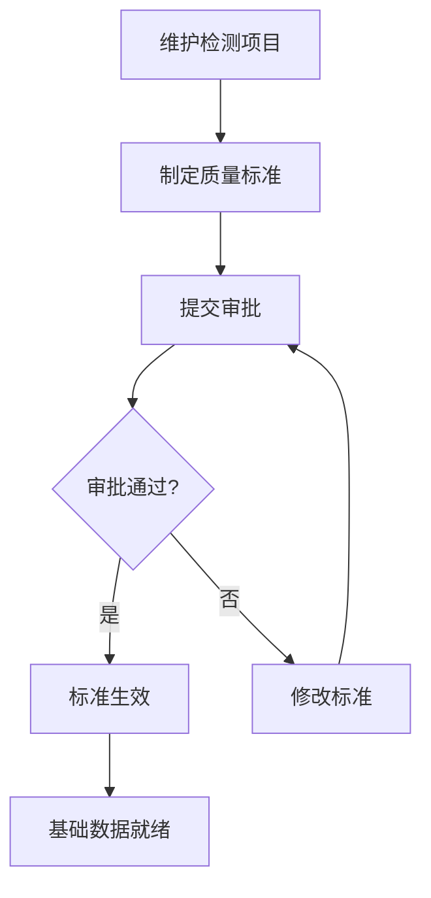
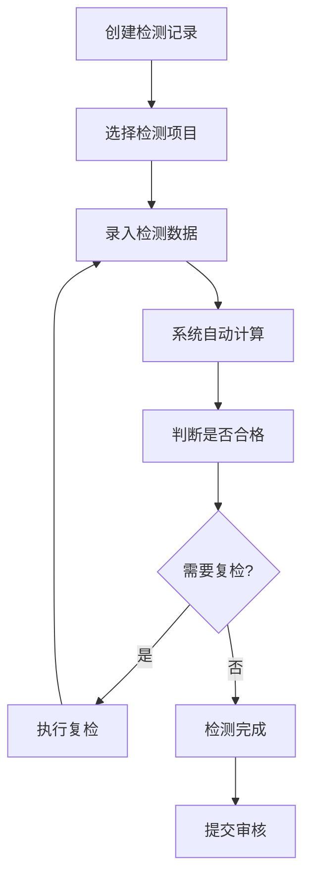
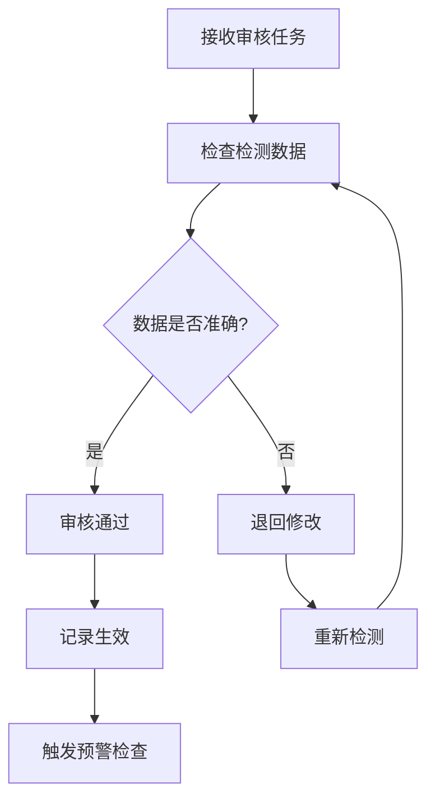
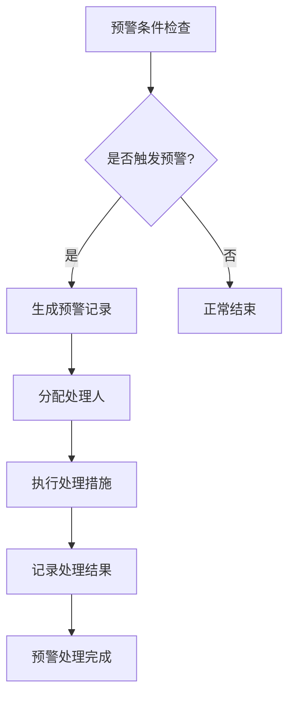

# 煤质管理模块业务逻辑设计

## 📋 模块概述

煤质管理模块是选煤厂生产管理系统的核心模块之一，负责管理煤炭产品的质量检测、标准制定、数据分析和预警处理等全流程业务。该模块确保煤炭产品质量符合国家标准和客户要求，为生产决策提供数据支持。

## 🏗️ 核心业务实体

### 1. 质量检测项目 (coal_quality_item)
**业务含义**：定义各种煤质检测项目的基础信息
**主要字段**：
- 项目编码、名称、类型
- 计量单位、检测方法、所需设备
- 标准值、最大最小值、预警上下限
- 精度位数、显示顺序、状态

**业务规则**：
- 检测项目是基础数据，其他模块都依赖于此
- 项目编码必须唯一
- 预警上下限用于自动判断是否触发预警
- 支持启用/停用状态管理

### 2. 质量标准 (coal_quality_standard)
**业务含义**：基于检测项目制定具体的质量标准
**主要字段**：
- 标准编码、名称、产品类型、产品规格
- 关联检测项目、标准值、允许公差
- 标准来源（如国标GB/T）、版本号
- 生效日期、失效日期、状态
- 审批人、审批时间

**业务规则**：
- 一个检测项目可以对应多个质量标准（不同产品类型/规格）
- 标准制定需要审批流程：草稿→启用→停用→归档
- 版本管理：支持标准修订和版本控制
- 时间有效性：通过生效/失效日期控制标准的使用时间

### 3. 质量检测记录 (coal_quality_inspection)
**业务含义**：记录每次质量检测的整体信息
**主要字段**：
- 检测编号、检测时间、班次信息
- 检测人员、审核人员信息
- 产品类型、产品规格、采样信息
- 检测状态、审核状态
- 环境信息（温度、湿度、天气）

**业务规则**：
- 检测编号自动生成，格式：QC+年月日+序号
- 检测状态流转：待检测→检测中→已完成→已审核
- 审核流程：必须有审核人员和审核时间
- 环境信息影响检测结果的准确性

### 4. 质量检测数据 (coal_quality_data)
**业务含义**：记录具体的检测数值（检测记录的子表）
**主要字段**：
- 关联检测记录、检测项目信息
- 检测值、标准值、偏差值、偏差率
- 是否合格、检测方法、检测设备
- 操作员信息、检测时间
- 复检信息（复检次数、是否复检、原始值）

**业务规则**：
- 一个检测记录可以包含多个检测项目的数据
- 系统自动计算偏差值和偏差率
- 复检机制：不合格时可以复检，记录复检历史
- 操作员信息用于责任追溯

### 5. 质量预警记录 (coal_quality_alert)
**业务含义**：当检测数据异常时触发的预警信息
**主要字段**：
- 预警编号、预警类型、预警级别
- 关联检测项目和检测记录
- 检测值、标准值、预警阈值、偏差值
- 预警信息、预警时间、预警状态
- 处理人信息、处理措施、处理结果
- 自动预警标识、通知发送状态

**业务规则**：
- 预警类型：超标预警、设备异常预警、数据异常预警等
- 预警级别：一般、重要、紧急
- 预警状态流转：待处理→处理中→已处理→已忽略
- 支持自动预警和手动预警两种方式

## 🔄 业务流程设计

### 1. 基础数据准备阶段

**业务步骤**：
1. **检测项目管理**：维护各种检测项目的基础信息
2. **质量标准制定**：基于检测项目制定针对不同产品类型的标准
3. **标准审批**：质量标准需要经过审批流程才能生效
4. **标准发布**：审批通过后标准生效，可供检测使用

### 2. 检测执行阶段

**业务步骤**：
1. **创建检测记录**：选择产品类型、检测项目、检测人员等
2. **录入检测数据**：逐个录入各检测项目的具体数值
3. **自动计算**：系统自动计算偏差值、偏差率等指标
4. **合格性判断**：基于标准值自动判断是否合格
5. **复检处理**：不合格时可选择复检，记录复检历史
6. **提交审核**：检测完成后提交给审核人员

### 3. 审核确认阶段

**业务步骤**：
1. **审核接收**：审核人员接收检测记录审核任务
2. **数据检查**：检查检测数据的准确性和完整性
3. **审核决策**：决定是否通过审核或退回修改
4. **记录生效**：审核通过后检测记录正式生效
5. **预警检查**：系统自动检查是否触发预警条件

### 4. 预警处理阶段

**业务步骤**：
1. **预警检查**：系统自动检查检测数据是否超出预警阈值
2. **预警生成**：触发预警条件时自动生成预警记录
3. **人员分配**：指定处理人员负责预警处理
4. **措施执行**：处理人员执行相应的处理措施
5. **结果记录**：记录处理措施和处理结果
6. **预警关闭**：处理完成后关闭预警记录

## 📊 关键业务规则

### 1. 数据关联规则
- **检测记录** → **检测数据**：一对多关系，一个检测记录包含多个检测项目的数据
- **检测数据** → **质量标准**：通过检测项目关联，获取对应的标准值
- **检测数据** → **检测项目**：通过检测项目ID关联，获取项目基础信息
- **预警记录** → **检测数据**：通过检测记录关联，获取异常数据信息

### 2. 状态流转规则
- **质量标准状态**：草稿 → 启用 → 停用 → 归档
- **检测记录状态**：待检测 → 检测中 → 已完成 → 已审核
- **预警记录状态**：待处理 → 处理中 → 已处理 → 已忽略

### 3. 审批流程规则
- **质量标准审批**：必须经过审批才能生效使用
- **检测记录审核**：必须经过审核才能正式生效
- **审批权限**：不同级别的标准需要不同级别的审批人员

### 4. 预警触发规则
- **自动预警**：检测数据超出预警上下限时自动触发
- **手动预警**：检测人员发现异常时手动创建预警
- **预警级别**：根据偏差程度确定预警级别（一般/重要/紧急）

### 5. 复检机制规则
- **复检条件**：检测结果不合格时可以申请复检
- **复检次数**：记录复检次数，避免无限复检
- **原始值保存**：复检时保存原始检测值用于对比分析
- **复检结果**：复检结果作为最终结果

## 🔧 系统集成点

### 1. 与生产计划模块集成
- 根据生产计划确定需要检测的产品类型和规格
- 检测结果影响生产计划的执行和调整

### 2. 与设备管理模块集成
- 检测设备信息来源于设备管理模块
- 设备状态影响检测数据的可靠性

### 3. 与人员管理模块集成
- 检测人员、审核人员、处理人员信息来源于人员管理
- 人员权限控制各环节的操作权限

### 4. 与报表统计模块集成
- 提供质量检测数据用于统计分析
- 生成质量趋势分析、合格率统计等报表

## 📈 业务价值

### 1. 质量保证
- 建立完整的质量检测体系，确保产品质量符合标准
- 通过预警机制及时发现和处理质量问题

### 2. 数据追溯
- 完整的检测数据记录，支持质量问题的追溯分析
- 人员责任明确，便于质量责任追究

### 3. 决策支持
- 提供准确的质量数据支持生产决策
- 通过统计分析发现质量趋势和问题

### 4. 合规管理
- 符合国家煤炭质量标准要求
- 支持质量认证和客户质量要求

## 🚀 扩展功能

### 1. 智能预警
- 基于历史数据建立预警模型
- 预测性预警，提前发现潜在质量问题

### 2. 移动端支持
- 支持移动端检测数据录入
- 现场检测人员可随时录入数据

### 3. 数据分析
- 质量趋势分析
- 检测设备性能分析
- 人员检测效率分析

### 4. 第三方集成
- 与检测设备直接集成，自动获取检测数据
- 与客户系统集成，自动推送质量报告

---

*本文档描述了煤质管理模块的完整业务逻辑，为系统开发和实施提供指导。*
